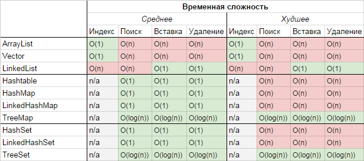

# Обзор структур данных из Java Collections Framework

# Структуры данных в Java

Классы, имплементирующие АТД и предназначенные для использования в общих случаях:

- **List** - ArrayList, LinkedList
- **Deque (Double-ended queue)** - ArrayDeque
- **Map** - HashMap, LinkedHashMap
- **Set** - HashSet, LinkedHashSet

Классы, которые предназначены для использования в специфических случаях:

- **TreeMap, TreeSet** - представляют собой Sorted Map (отсортированная мапа) и построены на основе *BST*
- **PriorityQueue** - имплементирует АТД Priority Queue (очередь с приоритетом). Построен на основе *Heap*

---

# Сложность выполнения операций в Java



---

# Обзор интерфейсов и классов структур данных в Java

# Интерфейсы

## List

List - это интерфейс, предназначенный для хранения и обхода элементов в порядке вставки.

Есть 2 имплементации листа:

- ArrayList на основе массива
- LinkedList на основе двусвязного списка

Из них нужно использовать ArrayList, так как она более эффективная в плане памяти и утилизации кеша. Однако, если
требуется удалять элементы с начала или в середине списка, то лучше выбрать LinkedList, так как операция удаления в
массиве требует времени O(n) против O(1) в двусвязном списке.

---

## Deque

[Deque](https://docs.oracle.com/en/java/javase/11/docs/api/java.base/java/util/Deque.html)

Deque может использоваться и как стек *LIFO (Last-in-First-out)*, и как очередь *FIFO (First-in-First-out)*.

Применение Deque:

- Если нужна LIFO или FIFO структура данных

Есть две имплементации дека:

- [ArrayDeque](https://docs.oracle.com/en/java/javase/11/docs/api/java.base/java/util/ArrayDeque.html)
- [Linked List](https://docs.oracle.com/en/java/javase/11/docs/api/java.base/java/util/LinkedList.html)

Из них нужно использовать *ArrayDeque*, потому что она наиболее эффективная в плане представления в памяти и утилизации
кэша, так как построена на основе массива: поддерживаются индексы на head и tail ячейки массива, куда элементы
добавляются с начала или с конца соответственно.

Полезные методы:

- addFirst, addList - добавить элемент в начало или конец дека соответственно
- peekFirst, pollFirst - если нужно посмотреть или посмотреть и удалить элемент в начале дека соответственно
- peekLast, pollLast - если нужно посмотреть или посмотреть и удалить элемент в конце дека соответственно

---

## Map

Map позволяет хранить пары типа \<ключ, значение>.

Есть две имплементации мапы:

- HashMap на основе хэширования
- LinkedHashMap, которая наследует HashMap с той разницей, что упорядочивает элементы в порядке их вставки путем
  поддержания двусвязного списка между элементами

---

## Set

Set предназначен для хранения уникальных значений.

Есть две имплементации сета:

- HashSet на основе хеширования. Внутри себя на самом деле поддерживает HashMap, оперируя только ее ключами
- LinkedHashSet, который наследует HashSet с той разницей, что упорядочивает элементы в порядке их вставки. Таким же
  образом, под капотом лежит LinkedHashMap

# Классы

## PriorityQueue

[PriorityQueue](https://docs.oracle.com/en/java/javase/11/docs/api/java.base/java/util/PriorityQueue.html)

PriorityQueue - это имплементация АТД "Очередь с приоритетом", которая построена на основе Heap.

Хотя эта структура данных и имплементирует интерфейс Queue, не надо рассматривать эту структуру данных как очередь FIFO,
так как PriorityQueue предназначена для другой цели: поддерживать в голове очереди наименьший или наибольший элемент
согласно некоторому компаратору. Поэтому элементы должны имплементировать Comparable интерфейс или должен быть определен
кастомный компаратор.

Эта структура данных не предназначена для обхода элементов, а ее iterator() не гарантирует никакого порядка обхода
элементов.

По-умолчанию PriorityQueue поддерживает в head наименьший элемент, но можно поддерживать и наибольший вот так:

```java
class MaxPriorityQueue {
    PriorityQueue<Integer> queue = new PriorityQueue<>(Comparator.<Integer>naturalOrder().reversed());
}
```

---

## TreeMap

[TreeMap](https://docs.oracle.com/en/java/javase/11/docs/api/java.base/java/util/TreeMap.html)

TreeMap - это мапа с отсортированным порядком элементов (sorted map), которая построена на основе BST, а точнее
Red-Black Tree.

Применение:

- Поддерживать отсортированный порядок элементов и обходить их в этом порядке
- Эффективно находить наследника (successor) или преемника (predecessor) указанного ключа

Полезные методы:

- lowerEntry(K), floorEntry(K), ceilingEntry(K) и higherEntry(K) - возвращают соответственно меньший, меньший или
  равный, больший или равный, и больший элемент чем указанный ключ
- subMap(K, boolean, K, boolean) - возвращают сабсет мапы между low и high границей. Boolean параметры указывают,
  inclusive или exclusive границы
- headMap(K, boolean) и tailMap(K, boolean) - возвращают сабсет мапы с ключами, соответственно меньшими или большими чем
  указанный. Boolean параметры указывают, inclusive или exclusive граница
