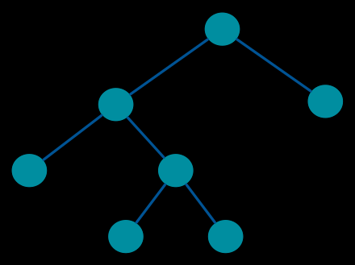
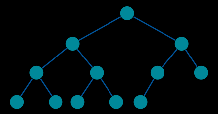
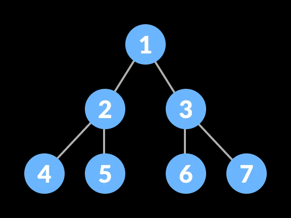
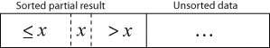
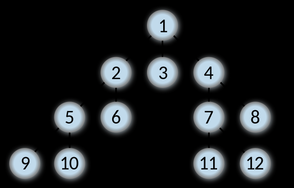
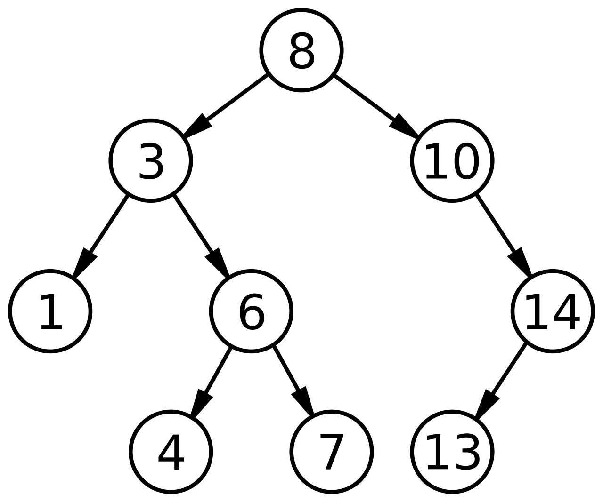
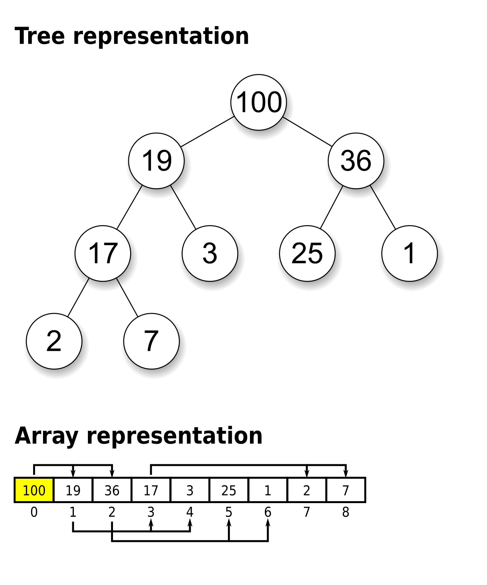

# Графы и деревья

В данной заметке я буду писать о графах и деревьях.

## Графы. Базовые понятия

Чтобы понять, что такое бинарные деревья, необходимо начать с графов.

Базовые понятия:

- **Граф (graph)** - это базовое понятие. Включает множество вершин и множество рёбер. Каждое ребро в графе соединяет
  две вершины.
- **Вершина (узел, Vertex, Node)** - базовое понятие. Точка, куда могут вести или выходить рёбра. Множество вершин графа
  G обозначается V(G).
- **Ребро (edge)** - базовое понятие. Ребро соединяет две вершины графа
- **Дуга** - ориентированное ребро. Если есть две вершины (v, w), то дуга может вести только из v -> w или же из w -> v,
  то есть одна из вершин - начало дуги, а другая - конец. Однако, часто понятия ребро и дуга взаимозаменяются

Вес ребер:

- **Вес ребра** - значение, поставленное в соответствие данному ребру взвешенного графа. Обычно вес — вещественное
  число, в таком случае его можно интерпретировать как «длину» ребра.
- **Взвешенный граф** - граф, каждому ребру которого назначен вес ребра

Петли и циклы:

- **Петля** - ребро, начало и конец которого находятся в одной и той же вершине
- **Цикл** - путь длины не менее 1, который начинается и заканчивается в одной и той же вершинеc
- **Ациклический граф** - граф без циклов

Инцидентность и смежность (это об отношениях ребен и вершин):

- **Инцидентность (incidence)** - означает, что если есть вершины u1, u2 и соединяющее их ребро e, тогда вершина u1 и
  ребро e инцидентны, как и вершина u2 с ребром e. Важно, что две вершины инцидентны быть не могут. Для обозначения
  ближайших вершин (рёбер) используется понятие смежности.
- **Смежность (adjacency)** - понятие, используемое в отношении только двух рёбер либо только двух вершин: два ребра,
  инцидентные одной вершине, называются смежными; две вершины, инцидентные одному ребру, также называются смежными.
- **Степень вершины** — количество рёбер, инцидентных вершине
- **Степень захода вершины** - количество ребер, входящих в вершину
- **Степерь исхода вершины** - количество ребер, исходящих из вершины

Связность (это о путях):

- **Связность** - две вершины в графе связаны, если существует соединяющий их путь.
- **Связный граф** — граф, в котором все вершины связаны.
- **Компонента связности графа** — такое подмножество вершин графа, для любых двух вершин которого существует путь из
  одной в другую, и не существует пути из вершины этого подмножества в вершину не из этого подмножества.

Путь и цикл:

- **Простой путь** — путь, все вершины которого попарно различны. Другими словами, простой путь не проходит дважды через
  одну вершину.
- **Простой цикл** — цикл, не проходящий дважды через одну вершину.
- **Расстояние между вершинами** — длина кратчайшего пути между двумя вершинами

Ориентированный граф:

- **Орграф (ориентированный граф, directed grapgh)** - граф, в котором все ребра ориентированы (есть только дуги)
- **Ориентированный ациклический граф (directed acyclic graph, DAG)** - ориентированный граф, в котором отсутствуют
  циклы

Другое:

- **Гамильтонов путь** — простой путь в графе, содержащий все вершины графа ровно по одному разу.
- **Гамильтонов граф** — граф, в котором есть гамильтонов цикл.
- **Эйлеров цийл** — цикл, который содержит все рёбра графа (вершины могут повторяться).
- **Эйлеров граф** — граф, в котором существует эйлеров цикл

## Дерево

Итак, мы выучили все базовые понятия, теперь можем перейти к деревьям.

**Дерево** — это связный неориентированный ациклический граф. Связность означает наличие маршрута между любой парой
вершин, ацикличность — отсутствие циклов. Отсюда следует, что число рёбер в дереве на единицу меньше числа вершин, а
между любыми парами вершин имеется один и только один путь

- **Ориентированное дерево** - это связный ориентированный ациклический граф (DAG), в котором только одна вершина имеет
  нулевую степень захода (корень), а все остальные вершины имеют степень захода 1 (в них ведёт ровно по одной дуге).
- **Корень дерева (root)** - выбранная вершина дерева. Или по-другому: вершина с нулевой степенью захода
- **Лист дерева (leaf)** - вершина дерева, из которого не исходит ни одна дуга, то есть вершина с нулевой степенью
  исхода
- **Высота дерева (height)** - наибольшая длина пути от корня к листу

Дерево как структура данных - это абстрактный тип данных, симулирующий структуру дерева - есть корень (root) и
поддеревья (subtrees). Каждый узел имеет не более одного родителя.

А вот это лес, к слову:
**Лес** — множество деревьев. Компонентами связности леса являются деревья.

## Двоичное дерево

**Двоичное (бинарное) дерево** - это:

- Ориентированное дерево, в котором исходящие степени вершин (число исходящих рёбер)
  не превосходят 2. Или же, эквивалентно:
- Структура данных, в которой каждый узел имеет не более двух детей. Как правило, сам узел называется родительским
  узлом, а дети называются левым и правым наследниками.

### Типы двоичных деревьев

**Full binary tree** - это двоичное дерево, где у каждого узла либо 0, либо 2 ребенка. То есть у всех нод кроме листьев
есть 2 ребенка.



**Complete binary tree** - это двоичное дерево, где все уровни дерева максимально заполнены, кроме, возможно,
последнего. Если последний уровень не полный, то уровень заполнен слева направо, причем листья стремятся к левой
стороне. Из этого следует, что глубина листьев отличается не более чем на один уровень



**Perfect binary tree** - это двоичное дерево, где у каждого узла есть 2 ребенка и все листья находятся на одинаковом
уровне. То есть, все уровни дерева заполнены максимально, включая последний.



**Сбалансированное дерево (balanced tree)** - это дерево, которое имеет минимально возможное количество уровней.
Очевидно, что это возможно, только если каждый уровень будет заполнен максимально.

Complete или perfect binary tree всегда являются сбалансированным деревом по определению, но не верно обратное, так как
сбалансированным может быть и full binary tree.

Сводка:

- Complete: должно быть сбалансированным; может быть full
- Perfect: должно быть сбалансированным; должно быть full
- Full: может быть сбалансированным; может быть complete

### Свойства сбалансированных деревьев (complete binary tree)

- Если считать что root - это 0 уровень, то на каждом уровне i, находится ровно 2^i элементов. На последнем же уровне k
  может быть от 1 до 2^k элементов

- Высота сбалансированного дерева - это log2(n), где n - количество элементов в дереве

Почему это так? Смотри, исходя из предыдущего утверждения, можно посчитать сумму узлов
так: `n = 2^0 + 2^1 + ... + 2^(h - 1)`, где h - количество уровней в дереве. Мы видим, что это геометрическая
прогрессия, и всю эту сумму можно представить как `n = 2^h - 1`. Отсюда можно вычислить `h = log2(n+1)`. Так как нам
нужно целое число, то можно или округлить n до ближайшей степени 2 в большую сторону или же просто взять ceiling от
результата, что на машине вычислить проще.

Запомни это - логарифм будет часто встречаться при ассимптотической оценке времени работы операций и связан именно с
высотой дерева.

### Применение деревьев

1. Дерево используется в качестве Abstract Syntax Tree (AST, помнишь, ты писал парсер?)



Тогда для AST:

- Pre-order обход позволяет сделать префиксную нотацию (Polish notation) - `+ 3 4`
- Post-order обход позволяет сделать постфиксную нотацию (Reverse Polish notation) - `3 4 +`. Такое выражение легко
  превращается в машинный код, чтобы далее выполнить этот код стек машиной
- In-order обход позволяет вывести элементы дерева в том порядке, который соответствует устройству дерева. Например, для
  BST это может использоваться для вывода элементов в соответствии с установленным компаратором (элемент в узле больше
  чем все элементы в левом поддереве и меньше чем все элементы в правом поддереве).

2. Дерево используется как структура данных. Например, BST или Heap.
3. Устройство файловых систем
4. Деревья поиска

---

## Обход деревьев

Обход дерева - это алгоритм посещения всех узлов в дереве по ровно одному разу. Данные алгоритмы классифицируются по
порядку обхода нод. Обход дерева бывает в глубину и ширину. Алгоритмы называются соответственно *DFS (depth-first
search)* и *BFS(breadth-first search)*.

Почему вообще нужны эти алгоритмы обхода? Дело в том, что деревья сильно отличаются по устройству от таких линейных
структур данных как массивы b списки, которые обычно обходятся все линейном порядке. Но так как дерево не имеет четкого
порядка элементов, то есть каждая нода имеет несколько нод, куда можно пойти дальше, а не линейный порядок, то для этого
нам и нужны специальные алгоритмы обхода.

При обходе нам необходимо хранить отложенные на каждом уровне дерева ноды для их дальнейшего посещения. Для этих целей
используют стек (stack) или очередь (queue). Однако, так как дерево - это self-referential (recursively defined)
data structure, то обход можно сделать с помощью рекурсии или даже корекурсии. В случае рекурсии мы храним отложенные
ноды в call stack, а в случае корекурсии мы вообще не заполняем стек.

## Обход в глубину

При обходе в глубину мы продвигаемся как можно глубже по дереву, прежде чем идти к следующему соседу. Для обхода в
глубину чаще всего используется рекурсивный метод и call stack, но возможна и итеративная имплементация с явным
созданием стека.

Анимация работы алгоритма:


Весь смысла рекурсивного обхода в глубину заключается в выполнении на каждой ноде следующих операций в определенном
порядке:

1. Посещение текущей ноды (N)
2. Рекурсивно обойти левого потомка текущей ноды (L)
2. Рекурсивно обойти правого потомка текущей ноды (L)

Виды обхода в глубину:

1. Preorder (NLR)
2. Postorder (LRN)
3. Inorder (LNR)

### Применение DFS

- Нахождение компонент связности
- Топологическая сортировка

---

## Обход в ширину

В обходе в ширину дерево обходит сначала все ноды на текущем уровне дерева слева направо, прежде чем углубляться на
нижний уровень. Вот порядок, в котором будет обойдено дерево:



Анимация, показывающая работу алгоритма BFS (черные - посещенные, серые - поставленные в очередь):


Для имплементации обхода в ширину используется очередь, работающая по принципу FIFO.

Обход в ширину обычно имплементируется как non-recursive алгоритм. Non-recursive алгоритм bfs отличается от
non-recursive dfs следующим:

1. Используется очередь (FIFO) вместо стека (LIFO)
2. Проверяется, не был ли посещен текущий узел прежде чем класть его в очередь, в отличии от dfs, где эта проверка
   производится уже после взятия элемента из стека

То есть, смотри как интересно: заменяя очередь в BFS на стек, мы получаем DFS.

Принцип работы заключается в том, что при посещении каждой ноды мы кладем ее левого, а затем правого потомка в очередь,
помечаем ноду как посещенную и берем следующий элемент из очереди, повторяя те же самые действия с ним. Так как очередь
работает по принципу FIFO, то мы знаем, что при взятии элемента из очереди, мы берем самый ранний встретившийся элемент,
то есть встретившийся на как можно более высоком уровне. Это означает, что мы не уйдем с текущего уровня дерева, пока не
обойдем все элементы на нем.

Помечать ноды как посещенные нам нужно для того, чтобы не обойти узел по несколько раз. А это может быть в графе. Так
как только дерево по определению не содержит циклом, но граф может содержать цикл.

### Применение BFS

- Нахождение наикратчайшего пути между двумя нодами

---

## Tail Call Optimization

Многие операции на деревьях могут быть имплементированы как рекурсивно, так и итеративно. И рекурсивно не всегда плохо,
так как существует такая вещь как Tail Call Optimization, которая происходит на уровне компиляции.

**Tail Call Optimization (TCO или Tail Call Elimination, TCE)** - это когда машина может сделать вызов функции без
выделения памяти на call stack, причем не обязательно рекурсивной. Единственная ситуация, когда происходит эта
оптимизация, это когда последняя инструкция в функции f - вызов другой функции g или же самой функции f, что называется
tail call, от чего и произошло имя оптимизации. Эта оптимизация возможна потому, что функция f не хранит никакие данные,
которые могли бы понадобиться позднее.

Tail Call Optimization особенно полезна при написании рекурсивных методов, так как они могут разрастаться по стеку
довольно далеко.

Вот такую функцию оптимизировать нельзя, так как в call stack нужно сохранить текущее значение n, чтобы позднее умножить
его на рекурсивный вызов:

```
def fact(n):
    if n == 0:
        return 1
    return n * fact(n - 1)
```

А вот эту функцию `fact_h` оптимизировать можно, так как никакой обработки результата рекурсивного вызова не требуется:

```
def fact_h(n, acc):
    if n == 0:
        return acc
    return fact_h(n - 1, acc * n)

def fact(n):
    return fact_h(n, 1)
```

**К сожалению, в Java нет TCO**. Такая оптимизация в основном есть в функциональных языках, а не императивных, например
Haskell, Scala.

---

## Двоичное дерево поиска (BST)

**Двоичное дерево поиска (Binary Search Tree, BST)** - двоичное дерево, для которого выполняются следующие условия:

1. Оба поддерева — левое и правое — являются двоичными деревьями поиска
2. У всех узлов левого поддерева произвольной вершины X значения ключей данных меньше, чем значение ключа данных самого
   узла X
3. У всех узлов правого поддерева произвольной вершины X значения ключей данных больше либо равны, чем значение ключа
   данных самого узла X

Очевидно, данные в каждом узле должны обладать ключами, на которых определена операция сравнения меньше.

Двоичное дерево поиска - это структура данных, которая может выступать в качестве имплементации некоторых АТД.  
Двоичное дерево поиска не следует путать с двоичной кучей, построенной по другим правилам. Ее мы рассмотрим позже.

Вот так выглядит двоичное дерево поиска:



Сложность выполнения операций:

|       | В среднем | В худшем |
|---------------|:---------:|:--------:|
| Расход памяти |   O(n)    |   O(n)   |
| Поиск         | O(log n)  |   O(n)   |
| Вставка       | O(log n)  |   O(n)   |
| Удаление      | O(log n) |   O(n)   |

### Основные операции на двоичном дереве поиска

Базовый интерфейс двоичного дерева поиска состоит из трёх операций:

1. Поиск элемента — поиск узла по ключу
2. Вставка элемента — добавление в дерево нового значения
3. Удаление элемента — удаление узла по ключу

#### Поиск элемента

Рекурсивная имплементация поиска довольно проста:

1. Если искомый элемент меньше текущего, то идем рекурсивно искать в левое поддерево
2. Иначе идем рекурсивно искать в правое поддерево

#### Вставка элемента

Мы вставляем новый элемент путем добавления листа.

Мы опускаемся по дереву вниз, на каждом шаге проверяя, куда пойти: если вставляемый элемент меньше чем текущий, то идем
в левое поддерево, иначе идем в правое. Если указатель на левое или правое поддерево = null, значит мы дошли до
родителя, к которому и нужно присоединить лист.

#### Поиск преемника или наследника

**Наследник** - это наименьший больший элемент, чем указанный.

Поиск наследника указанной ноды X работает так:

1. Если для ноды X существует правое поддерево, то возвращаем минимум из этого поддерева
2. Иначе смотри. Мы знаем, что если мы - левая нода родителя, то родитель больше нас, если же мы - правая нода родителя,
   то родитель меньше нас. Так как нам нужно найти больший элемент, чем указанный, это означает, что нам нужно найти
   такого родителя, для которого предыдущий родитель был его левой нодой

**Преемник** - это наибольший меньший элемент, чем указанный.

Поиск преемника указанной ноды X работает так по аналогии:

1. Если для ноды X существует левое поддерево, то возвращаем максимум из этого поддерева
2. Иначе нам нужно найти такого родителя, для которого предыдущий родитель был его правой нодой

### Обход двоичного дерева поиска

In-order dfs обход двоичного дерева поиска позволяет обойти элементы дерева в неубывающем порядке ключей, что можно
использовать для сортировки. Если же использовать preorder dfs, то это позволяет нам вывести элемента дерева в порядке в
соответствии с устройством дерева.

Другие варианты обхода нам не интересны, так как не дают полезного порядка.

### Применение двоичного дерева поиска

Основным преимуществом двоичного дерева поиска перед другими структурами данных является возможная высокая эффективность
основанных на нём алгоритмов поиска и сортировки.

BST позволяют сделать операции поиска, добавления и удаления данных за время за O(log n). BST может использоваться для:

1. Имплементация таких абстрактных типов данных как сет, мультисет и словарь
2. Сортировка Tree Sort, которая основана на BST
3. Поиск элементов

Время log n исходит из того, что для поиска, добавления или удаления на каждом вызове рекурсии мы постоянно снижаемся
ниже по дереву, что в среднем случае занимает ровно столько шагов, сколько уровней в дереве. Так как дерево не
сбалансированное, то bst может деградировать в односвязный список, что в худшем случае приводит к времени O(n).

По сути, поиск в двоичном дереве поиска - это binary search.

### Наличие в языках

- В Java бинарное дерево поиска представлено в виде TreeMap/TreeSet, где используется Red-Black Tree

---

## Куча (Heap)

**Куча (heap)** - это структура данных, которая удовлетворяет *свойству кучи*: если B является ребенком узла A, то ключ(
A) >= ключ (B). То есть, значение в любой вершине не меньше, чем значения ее детей.

Из этого свойства кучи следует, что элемент с наибольшим ключом всегда является корнем кучи, поэтому такие кучи также
называются max-кучами. Однако, если сравнение в свойстве перевернуть, то корневым узлом будет наименьший элемент
(min-куча).

Куча обычно устроена в памяти в виде массива.

### Основные операции над кучей

- Найти максимум (минимум): найти максимальный элемент в max-куче (min-куче)
- Извлечь максимум (минимум): извлечь корневой узел
- Увеличить или уменьшить ключ: обновить ключ в некотором узле с поддержанием свойства кучи
- Добавить: добавление нового элемента в кучу с поддержанием свойства кучи

## Бинарная куча

**Бинарная куча (пирамида)** - это структура данных типа куча, для которой выполняется 2 условия:

- Свойство кучи: ключ в каждом узле больше или равен, чем любой из детей
- Свойство формы: бинарная куча - это полное или почти полное бинарное дерево (complete binary tree), то есть все уровни
  дерева заполнены, кроме, возможно, последнего. Если последний уровень не полный, то уровень заполнен слева направо,
  причем все листья стремятся к левой стороне. Из этого следует, что глубина листьев отличается не более чем на один
  уровень

Далее мы будем говорить только о max-кучах для удобства.

Вот как выглядит max куча:



Сложность выполнения операций:

|                | В среднем | В худшем |
|----------------|:---------:|:--------:|
| Расход памяти  |   O(n)    |   O(n)   |
| Поиск          |   O(n)    |   O(n)   |
| Вставка        |   O(1)    | O(log n) |
| Поиск max      |   O(1)    |   O(1)   |
| Извлечение max | O(log n)  | O(log n) |

### Представление бинарной кучи

Полная бинарная куча может быть представлена очень эффективным способом с помощью индексного массива. Первый элемент
будет содержать корень. Следующие два элемента массива содержат ребенков корня. Следующие четыре элемента содержат
ребенков этих ребенков и так далее. Таким образом, ребенка узла i будут расположены на позициях 2i и 2i+1 для массива,
индексируемого с единицы, или на позициях 2i+1 и 2i+2 для массива, индексируемого с нуля. Это позволяет перемещаться
вверх или вниз по дереву, выполняя простые вычисления индекса массива.

### Имплементация операций над кучей

#### Восстановление свойства кучи (heapify, max-heapify, down-heapify)

Если элемент в ноде уменьшается, то может нарушиться свойство кучи, так как элемент может перестать быть больше детей.

Heapify подразумевает, что левое и правое поддеревья удовлетворяют условию упорядоченности, и нам нужно исправить только
переданную ноду. Эта процедура принимает на вход массив элементов A и индекс i. Она восстанавливает свойство
упорядоченности во всём поддереве, корнем которого является элемент A.

Если i-й элемент больше, чем его сыновья, то всё поддерево уже является кучей, и делать ничего не надо. В противном
случае меняем местами i-й элемент с наибольшим из его сыновей, после чего выполняем Heapify повторно для этого элемента.
Наибольшего из сыновей нужно брать, чтобы после свопа родителя и ребенка этот ключ был как больше родителя, так и
другого ребенка.

Выполнять повторно heapify нужно потому, что после свопа элемент может все еще быть меньше чем его новые ребенки, и его
нужно опускать вниз до тех пор, пока не будет выполнено свойство кучи.

Процедура выполняется за время O(log n).

Heapify - это всегда опускание элемента вниз. Поэтому heapify иногда зовется down-heapify, sink-down, bubble-down.

#### Up-Heapify

*Up-heapify* - это процедура для восстановления свойства кучи путем поднятия слишком большого элемента наверх, так как
данный элемент может быть больше своего родителя, что не удовлетворяет условию кучи.

Если элемент меньше своего родителя, условие соблюдено для всего дерева, и больше ничего делать не нужно. Если он
больше, мы меняем его местами с родителем. Мы повторяем это действие до тех пор, пока не восстановим свойство кучи. То
есть, в итоге этой операции слишком большой элемент всплывает наверх.

Также эта процедура называется sink up, bubble up (всплытие).

Процедура up-heapify нужна нам для процедуры добавления элемента.

#### Построение кучи

Эта процедура предназначена для создания кучи из неупорядоченного массива входных данных.

Заметим, что если выполнить Heapify для всех элементов массива A, начиная с последнего и кончая первым, он станет кучей.
В самом деле, легко доказать по индукции, что к моменту выполнения Heapify(A, i) все поддеревья, чьи корни имеют индекс
больше i, являются кучами, и, следовательно, после выполнения Heapify(A, i) кучей будут все поддеревья, чьи корни имеют
индекс, не меньший i.

Можно заметить, что Heapify(A,i) не делает ничего, если i>N/2 (при нумерации с первого элемента), где N — количество
элементов массива. В самом деле, у таких элементов нет детей и мы не сможем сравнить ключ ни с чем. то есть вызов
heapify не будет иметь эффекта. Следовательно, соответствующие поддеревья уже являются кучами, так как содержат всего
один элемент.

Тт есть, вся фишка работы данной процедуры в том, что начиная с i = N/2 и передавая дерево с таким корнем, мы знаем, что
все его дети - уже кучи, так как содержат всего 1 элемент. Таким же образом это справедливо для всех последующих вызовов
heapify(A, i), так как его дети имеют индекс больший чем i, а такие индексы мы уже прошли раннее.

Таким образом, достаточно вызвать Heapify для всех элементов массива A, начиная с (N/2)-го и кончая нулевым.

#### Изменение значение элемента

Процедура заменяет элемент кучи на новый ключ с любым значением (не важно, меньшим или большим значения исходного
элемента). Временная сложность O(log n).

Вот как мы опускаем значение:

1. Изменяем значение в ноде на новое, меньшее или равное чем исходное
2. Вызываем down-heapify на нем

А вот как мы поднимаем значение:

1. Изменяем значение в ноде на новое, большее или равное чем исходное
2. Вызываем up-heapify на нем

#### Добавление элемента

Добавляет новый элемент в кучу за время O(log n).

Имплементация:

1. Добавление элемента в конец кучи
2. Вызов up-heapify на этом элементе

Сложность - O(log n).

#### Извлечение максимального элемента

Выполняет извлечение максимального элемента из кучи за время O(log n).

Извлечение выполняется в четыре этапа:

1. В переменную сохраняется значение корневого элемента (который и является максимальным)
2. Самый последний элемент перемещается в корень
3. Вызывается maxHeapify для нового корня, чтобы восстановить свойство кучи
4. Возвращается максимальный элемент из сохраненной переменной

### Применение кучи

- Куча используется как эффективная имплементация АТД "Очередь с приоритетом"
- Пирамидальная сортировка, которая использует внутри себя кучу
- Алгоритмы поиска: при использовании кучи поиск минимума, максимума, медианы или k-го наибольшего элемента может быть
  сделан за линейное время (часто даже за константное время)

### Наличие в различных языках

- Java имеет бинарную кучу в виде класса PriorityQueue

### Пирамидальная сортировка

Здесь же опишу пирамидальную сортировку, которая выполняется за время O(n * log n) на месте (без привлечения
дополнительной памяти).

Идея работы алгоритма. Мы знаем, что первый элемент кучи - это корень, где всегда лежит максимальный элемент. Если
обменять корень с последним элементом, то в конце массива будет лежать максимальный элемент из кучи. Если после этого
исключить последний элемент из кучи, то есть уменьшить размер кучи на 1, то первые N-1 элементов кучи будут
удовлетворять свойству кучи, кроме, возможно, корня. Но мы можем вызвать heapify на корне и снова восстановить свойство
кучи, после чего в корне будет лежать наибольшее значение из всех оставшихся элементов кучи. Мы снова обмениваем корень
с последним элементом и повторяем те же самые действия. В итоге, когда после множества повторений элементов в куче
больше не останется, мы получим отсортированный массив.

---

## Binary Search Tree vs Binary Heap

Так когда же использовать BST, а когда кучу? Давай разберемся.

Чем они похожи:

- Они оба - двоичные деревья. ВСЕ.

Чем они различаются:

- BST - это структура данных с определенным порядком элементом, то есть мы можем пройтись по ней в возрастающем или
  убывающем порядке. В куче же нет определенного порядка элементов
- BST может быть как сбалансированным, так и несбалансированным, ведь оно может выродиться в односвязный список. Heap -
  это полное бинарное дерево, которое по определению не может быть несбалансированным
- Временем работы операций

Поговорим подробнее про время работы операций:

*Поиск:*

- В BST поиск произвольного ключа в среднем случае выполняется за O(log n), так как в нем по сути работает бинарный
  поиск. Однако при деградации в односвязный список поиск может занять время O(n)
- В Heap поиск произвольного ключа выполняется за O(n), однако поиск max элемента работает за O(1) во всех случаях

*Вставка:*

- В BST вставка в среднем случае выполняется за O(log n), в худшем случае за O(n)
- В Heap вставка в среднем случае выполняется за O(1), в худшем случае за O(log n)

Почему же вставка в Heap выполняется в среднем за O(1)? Вот интуитивные аргументы:

- нижние элементы имеют экспоненциально большее число элементов, чем верхние, поэтому наверняка новые элементы пойдут
  ближе к нижнему уровню
- вставка в кучу происходит с низа дерева, а в BST - сверху. Принимая во внимание первый пункт, понятно, что в BST
  придется сделать больше шагов, чтобы найти место для вставки

Даже более скажу, довести в куче вставку до времени O(log n) практически нереально. Это будет почти всегда
гарантированно константное время (здесь есть тест - https://stackoverflow.com/a/29548834/8521177).

*Удаление:*

- в BST удаление в среднем выполняется за O(log n), но в худшем случае может занять O(n)
- В Heap удаление max элемента выполняется за O(log n) во всех случаях

Таким образом, мы видим, что куча особенно хорошо подходит:

- Когда нам нужно добиться эффективного константного времени вставки элементов - это основная фича
- Когда нам нужно эффективно работать с максимальным элементом
- Когда нам нужно использовать как можно меньше памяти, т.к. куча может быть представлена в виде массива

BST подходит, если:

- Если нужен быстрый поиск произвольного элемента - это основная фича

Часто говорят, что именно куча позволяет эффективно работать с максимальным элементом. Однако, это спорный момент. Ведь
что мешает нам просто поддерживать указатель на максимальный элемент в BST? Тогда мы смогли бы и находить его за O(1), и
удалять его за O(log n). Так что этот момент такой спорный. Но да, скорее я бы предпочел heap все таки, так как она
представлена в памяти эффективнее, и удаление элемента даже в худшем случае займет O(log n), в отличии от BST, где оно
может занять O(n).

---

## Implicit data structure

**Implicit data structure (space-efficient data structure)** - это структура данных, которая содержит малое количество
дополнительной информации кроме как самих основных данных, то есть такая структура данных имеет очень низкий overhead.
Эти структуры данных называются implicit, потому что позиция элементов имеет смысл и отношение между элементами. Так,
например, часто бинарные деревья представляются в виде нод и указателей на ноды, что несет за собой накладные расходы на
память, так как нода - это объект, а также нам нужно хранить указатели.

Так, бинарное дерева поиска обычно представляется в виде нод и указателей на ноды (хотя и возможно представление в виде
массива). А куча же использует всегда массив для хранения данных.

## Backtracking

// todo

---

## Binary Tree Visualizer

Прикольный сайт, где можно поиграться с двоичными деревьями - http://btv.melezinek.cz/

---

## Сбалансированные деревья

**Сбалансированные деревья (Self-balancing binary search tree)** - это такие бинарные деревья поиска, где уровень
поддеревьев различается не более чем на 1, при чем это свойство поддерживается постоянно в независимости от количества
элементов и порядка добавления элементов.

Сбалансированные деревья дают такое же время выполнения операций в среднем случае, как и обычная имплементация BST, но
все дело в худшем случае. Так как дерево постоянно остается сбалансированным, то деградации в односвязный список никогда
не будет, и поэтому такие операции как поиск, вставка и удаление будут всегда работать за O(log n).

Примеры сбалансированных BST - Red-Black Tree и AVL Tree. Далее речь пойдет о них.

## Red-Black Tree (Красно-Черное дерево)

https://www.baeldung.com/cs/red-black-trees

---

## AVL Tree

// todo

---