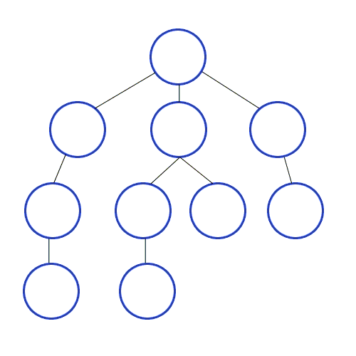

# Графы и деревья

В данной заметке я буду писать о графах и деревьях.

## Графы. Базовые понятия

Чтобы понять, что такое бинарные деревья, необходимо начать с графов.

Базовые понятия:
**Граф** - это базовое понятие. Включает множество вершин и множество рёбер. Каждое ребро в графе соединяет две вершины.
**Вершина (узел)** - базовое понятие. Точка, куда могут вести или выходить рёбра. Множество вершин графа G обозначается
V(G).
**Ребро** - базовое понятие. Ребро соединяет две вершины графа
**Дуга** - ориентированное ребро. Если есть две вершины (v, w), то дуга может вести только из v -> w или же из w -> v,
то есть одна из вершин - начало дуги, а другая - конец. Однако, часто понятия ребро и дуга взаимозаменяются

Вес ребер:
**Вес ребра** - значение, поставленное в соответствие данному ребру взвешенного графа. Обычно вес — вещественное число,
в таком случае его можно интерпретировать как «длину» ребра.
**Взвешенный граф** - граф, каждому ребру которого назначен вес ребра

Петли и циклы:
**Петля** - ребро, начало и конец которого находятся в одной и той же вершине
**Цикл** - путь длины не менее 1, который начинается и заканчивается в одной и той же вершине
**Ациклический граф** - граф без циклов

Инцидентность и смежность (это об отношениях ребен и вершин):
**Инцидентность** - означает, что если есть вершины u1, u2 и соединяющее их ребро e, тогда вершина u1 и ребро e
инцидентны, как и вершина u2 с ребром e. Важно, что две вершины инцидентны быть не могут. Для обозначения ближайших
вершин (рёбер) используется понятие смежности.
**Смежность** - понятие, используемое в отношении только двух рёбер либо только двух вершин: два ребра, инцидентные
одной вершине, называются смежными; две вершины, инцидентные одному ребру, также называются смежными.
**Степень вершины** — количество рёбер, инцидентных вершине
**Степень захода вершины** - количество ребер, входящих в вершину
**Степерь исхода вершины** - количество ребер, исходящих из вершины

Связность (это о путях):
**Связность** - две вершины в графе связаны, если существует соединяющий их путь.
**Связный граф** — граф, в котором все вершины связаны.
**Компонента связности графа** — такое подмножество вершин графа, для любых двух вершин которого существует путь из
одной в другую, и не существует пути из вершины этого подмножества в вершину не из этого подмножества.

Путь и цикл:
**Простой путь** — путь, все вершины которого попарно различны. Другими словами, простой путь не проходит дважды через
одну вершину.
**Простой цикл** — цикл, не проходящий дважды через одну вершину.
**Расстояние между вершинами** — длина кратчайшего пути между двумя вершинами

Ориентированный граф:
**Орграф (ориентированный граф, directed grapgh)** - граф, в котором все ребра ориентированы (есть только дуги)
**Ориентированный ациклический граф (directed acyclic graph, DAG)** - ориентированный граф, в котором отсутствуют циклы,
но могут быть «параллельные» пути, выходящие из одного узла и разными путями приходящие в конечный узел

Понятия на будущее:
**Гамильтонов путь** — простой путь в графе, содержащий все вершины графа ровно по одному разу.
**Гамильтонов граф** — граф, в котором есть гамильтонов цикл.
**Эйлеров цийл** — цикл, который содержит все рёбра графа (вершины могут повторяться).
**Эйлеров граф** — граф, в котором существует эйлеров цикл

## Дерево

Итак, мы выучили все базовые понятия, теперь можем перейти к деревьям:
**Дерево** — это связный неориентированный ациклический граф. Связность означает наличие маршрута между любой парой
вершин, ацикличность — отсутствие циклов. Отсюда следует, что число рёбер в дереве на единицу меньше числа вершин, а
между любыми парами вершин имеется один и только один путь
**Ориентированное дерево** - это связный ориентированный ациклический граф (DAG), в котором только одна вершина имеет
нулевую степень захода (корень), а все остальные вершины имеют степень захода 1 (в них ведёт ровно по одной дуге).
**Корень дерева** - выбранная вершина дерева. Или по-другому: вершина с нулевой степенью захода
**Лист дерева** - вершина дерева, из которого не исходит ни одна дуга, то есть вершина с нулевой степенью исхода
**Высота дерева** - наибольшая длина пути от корня к листу

Дерево как структура данных - это абстрактный тип данных, симулирующий структуру дерева - есть корень (root) и
поддеревья (subtrees). Каждый узел имеет не более одного родителя.

А вот это лес, к слову:
**Лес** — множество деревьев. Компонентами связности леса являются деревья.

**Двоичное (бинарное) дерево** - это ориентированное дерево, в котором исходящие степени вершин (число исходящих рёбер)
не превосходят 2. Или же, эквивалентно:
**Двоичное (бинарное) дерево** - структура данных, в которой каждый узел имеет не более двух детей. Как правило, сам
узел называется родительским узлом, а дети называются левым и правым наследниками.

Свойства дерева:

- Любое дерево с n вершинами содержит n−1 ребро

### Применение деревьев

- Дерево часто используется в качестве Abstract Syntax Tree (AST, помнишь, ты писал парсер?)


Тогда для AST:

- Pre-order обход позволяет сделать префиксную нотацию (Polish notation) - `+ 3 4`
- Post-order обход позволяет сделать постфиксную нотацию (Reverse Polish notation) - `3 4 +`. Такое выражение легко
  превращается в машинный код, чтобы далее выполнить этот код стек машиной
- In-order обход позволяет вывести элементы дерева в том порядке, который соответствует устройству дерева. Например, для
  BST это может использоваться для вывода элементов в соответствии с установленным компаратором (элемент в узле больше
  чем все элементы в левом поддереве и меньше чем все элементы в правом поддереве).

- Дерево используется как структура данных в виде, например, BST или Heap.
- Устройство файловых систем
- Деревья поиска

---

## Двоичное дерево поиска (BST)

**Двоичное дерево поиска (Binary Search Tree, BST)** - двоичное дерево, для которого выполняются следующие условия:

1. Оба поддерева — левое и правое — являются двоичными деревьями поиска;
2. У всех узлов левого поддерева произвольной вершины X значения ключей данных меньше, нежели значение ключа данных
   самого узла X;
3. У всех узлов правого поддерева произвольной вершины X значения ключей данных больше либо равны, нежели значение ключа
   данных самого узла X.

Очевидно, данные в каждом узле должны обладать ключами, на которых определена операция сравнения меньше.

Двоичное дерево поиска - это структура данных, которая может выступать в качестве имплементации некоторых АТД.  
Двоичное дерево поиска не следует путать с двоичной кучей, построенной по другим правилам. Ее мы рассмотрим позже.

Сложность выполнения операций:

|       | В среднем | В худшем |
|---------------|:---------:|:--------:|
| Расход памяти |   O(n)    |   O(n)   |
| Поиск         | O(log n)  |   O(n)   |
| Вставка       | O(log n)  |   O(n)   |
| Удаление      | O(log n) |   O(n)   |

### Основные операции на двоичном дереве поиска

Базовый интерфейс двоичного дерева поиска состоит из трёх операций:

1. FIND/LOOKUP(K) — поиск узла, в котором хранится пара (key, value) с key = K.
2. INSERT(K, V) — добавление в дерево пары (key, value) = (K, V).
3. REMOVE(K) — удаление узла, в котором хранится пара (key, value) с key = K.

По сути, двоичное дерево поиска — это структура данных, способная хранить таблицу пар (key, value). Двоичное дерево
поиска может использоваться в качестве имплементации словаря.

Вот как можно имплементировать эти операции:
LOOKUP - алгоритм:

- Если дерево пусто, сообщить, что узел не найден, и остановиться.
- Иначе сравнить K со значением ключа корневого узла X.
    - Если K=X, выдать ссылку на этот узел и остановиться.
    - Если K>X, рекурсивно искать ключ K в правом поддереве Т.
    - Если K<X, рекурсивно искать ключ K в левом поддереве Т.

INSERT - алгоритм:

- Если дерево пусто, заменить его на дерево с одним корневым узлом ((K, V), null, null) и остановиться.
- Иначе сравнить K с ключом корневого узла X.
    - Если K>X, рекурсивно добавить (K, V) в правое поддерево Т.
    - Если K<X, рекурсивно добавить (K, V) в левое поддерево Т.
    - Если K=X, заменить V текущего узла новым значением.

REMOVE - алгоритм:
Алгоритм:

- Если дерево T пусто, остановиться;
- Иначе сравнить K с ключом X корневого узла n.
    - Если K>X, рекурсивно удалить K из правого поддерева Т;
    - Если K<X, рекурсивно удалить K из левого поддерева Т;
    - Если K=X, то необходимо рассмотреть три случая.
        - Если обоих детей нет, то удаляем текущий узел и обнуляем ссылку на него у родительского узла;
        - Если одного из детей нет, то значения полей ребёнка m ставим вместо соответствующих значений корневого узла,
          затирая его старые значения, и освобождаем память, занимаемую узлом m;
        - Если оба ребёнка присутствуют, то
            - Если левый узел m правого поддерева отсутствует (n->right->left)
                - Копируем из правого узла в удаляемый поля K, V и ссылку на правый узел правого потомка.
            - Иначе
                - Возьмём самый левый узел m, правого поддерева n->right;
                - Скопируем данные (кроме ссылок на дочерние элементы) из m в n;
                - Рекурсивно удалим узел m.

### Обход двоичного дерева поиска

In-order dfs обход двоичного дерева поиска позволяет обойти элементы дерева в неубывающем порядке ключей, что можно
использовать для сортировки. Если же использовать preorder dfs, то это позволяет нам вывести элемента дерева в порядке в
соответствии с устройством дерева.

Другие варианты обхода нам не интересны, так как не дают полезного порядка.

### Применение двоичного дерева поиска

Основным преимуществом двоичного дерева поиска перед другими структурами данных является возможная высокая эффективность
основанных на нём алгоритмов поиска и сортировки.

BST позволяют сделать быстрые за O(log n) операции поиска, добавления и удаления данных. BST может использоваться для:

1. Имплементации таких абстрактных типов данных как сет, мультисет и мапа
2. Сортировки Tree Sort, которая основана на BST

Время log n исходит из того, что для поиска, добавления или удаления на каждом вызове рекурсии мы постоянно снижаемся
ниже по дереву, что в среднем случае занимает ровно столько шагов, сколько уровней в дереве. Понятно, что так как дерево
не сбалансированное, то bst может деградировать в односвязный список, что в худшем случае приводит к времени O(n).

По сути, поиск в двоичном дереве поиска - это binary search.

---

## Обход деревьев

Обход дерева - это алгоритм посещения всех узлов в дереве по ровно одному разу. Данные алгоритмы классифицируются по
порядку обхода нод. Обход дерева бывает в глубину и ширину. Алгоритмы называются соответственно *DFS (depth-first
search)* и *BFS(breadth-first search)*.

Почему вообще нужны эти алгоритмы обхода? Дело в том, что деревья сильно отличаются по устройству от таких линейных
структур данных как массивы b списки, которые обычно обходятся все линейном порядке. Но так как дерево не имеет четкого
порядка элементов, то есть каждая нода имеет несколько нод, куда можно пойти дальше, а не линейный порядок, то для этого
нам и нужны специальные алгоритмы обхода.

При обходе нам необходимо хранить отложенные на каждом уровне дерева ноды для их дальнейшего посещения. Для этих целей
часто используют стек (stack) или очередь (queue). Однако, так как дерево - это self-referential (recursively defined)
data structure, то обход можно сделать с помощью рекурсии или даже корекурсии. В случае рекурсии мы храним отложенные
ноды в call stack, а в случае корекурсии мы вообще не заполняем стек. Корекурсия - это такая рекурсия, которая для
дальнейшего вызова использует данные, которая сама же и произвела, начиная с базового случая. Это не похоже на рекурсию,
так как рекурсия наоборот, использует полученных данные, в итоге приходя к базовому случая. Когда выполняется
корекурсия, не происходит заполнения call stack, так как нет необходимости хранить на каждом вызове текущие данные перед
следующим вызовом рекурсии. Например, вот рекурсивная функция для вычисления факториала:

```python
def factorial(n):
    """Recursive factorial function."""
    if n == 0:
        return 1
    else:
        return n * factorial(n - 1) // 
```

Здесь мы храним переменную n в call stack, чтобы затем умножить ее на полученный от рекурсивного вызова результат.

Вот еще почитать про корекурсию

- https://edward-huang.com/functional-programming/algorithm/programming/scala/2020/08/02/wtf-is-corecursion/.

## Обход в глубину

При обходе в глубину мы продвигаемся как можно глубже по дереву, прежде чем идти к следующему соседу. Для обхода в
глубину чаще всего используется рекурсивный метод и call stack, но возможна и итеративная имплементация с явным
созданием стека.

Анимация работы алгоритма:


Весь смысла рекурсивного обхода в глубину заключается в выполнении на каждой ноде следующих операций в определенной
порядке:

1. Посещение текущей ноды (N)
2. Рекурсивно обойти левого потомка текущей ноды (L)
2. Рекурсивно обойти правого потомка текущей ноды (L)

Виды обхода в глубину:

1. Preorder (NLR)
2. Postorder (LRN)
3. Inorder (LNR)

Обход дерева на рисунке - красный - Pre-Order, зеленый - In-Order, синий - Post-order


### Применение DFS

- Нахождение компонент связности
- Топологическая сортировка

---

## Обход в ширину

В обходе в ширину дерево обходит сначала все ноды на текущем уровне дерева слева направо, прежде чем углубляться на
нижний уровень. Вот порядок, в котором будет обойдено дерево:


Анимация, показывающая работу алгоритма BFS (черные - посещенные, серые - поставленные в очередь):


Для имплементации обхода в ширину используется очередь, работающая по принципу FIFO.

Обход в ширину обычно имплементируется как non-recursive алгоритм. Non-recursive алгоритм bfs отличается от
non-recursive dfs следующим:

1. Используется очередь (FIFO) вместо стека (LIFO)
2. Проверяется, не был ли посещен текущий узел прежде чем класть его в очередь, в отличии от dfs, где эта проверка
   производится уже после взятия элемента из стека

То есть, смотри как интересно: заменяя очередь в BFS на стек, мы получаем DFS.

Принцип работы заключается в том, что при посещении каждой ноды мы кладем ее левого, а затем правого потомка в очередь,
помечаем ноду как посещенную и берем следующий элемент из очереди, повторяя те же самые действия с ним. Так как очередь
работает по принципу FIFO, то мы знаем, что при взятии элемента из очереди, мы берем самый ранний встретившийся элемент,
то есть встретившийся на как можно более высоком уровне. Это означает, что мы не уйдем с текущего уровня дерева, пока не
обойдем все элементы на нем.

Помечать ноды как посещенные нам нужно для того, чтобы не обойти узел по несколько раз. А это может быть в графе. Так
как только дерево по определению не содержит циклом, но граф может содержать цикл.

### Применение BFS

- Нахождение наикратчайшего пути между двумя нодами

---

## Куча

**Куча** - это структура данных, которая удовлетворяет *свойству кучи*: если B является ребенком узла A, то ключ(A) >=
ключ (B). То есть, значение в любой вершине не меньше, чем значения ее детей

Из этого свойства кучи следует, что элемент с наибольшим ключом всегда является корнем кучи, поэтому иногда такие кучи
называются max-кучами. Однако, если сравнение в свойстве перевернуть, то корневым узлом будет наименьший элемент
(min-куча).

Куча обычно устроена в памяти в виде массива.

### Основные операции над кучей

- Найти максимум (минимум): найти максимальный элемент в max-куче (min-куче)
- Удалить максимум (минимум): удалить корневой узел
- Увеличить или уменьшить ключ: обновить ключ в некотором узле с поддержанием свойства кучи
- Добавить: добавление нового элемента в кучу с поддержанием свойства кучи

## Бинарная куча

**Бинарная куча (пирамида)** - это структура данных типа куча, для которой выполняется 2 условия:

Далее мы будем говорить только о max-кучах для удобства.

- Свойство кучи: ключ в каждом узле больше или равен, чем любой из ключей детей
- Свойство формы: бинарная куча - это полное бинарное дерево (complete binary tree), то есть все уровни дерева
  заполнены, кроме, возможно, последнего. А если последний уровень не полный, то узлы заполнены слева направо. Для
  полного бинарного дерева также верно, что глубина листьев отличается не более чем на один уровень.

### Представление бинарной кучи

Полная и почти полная бинарная куча может быть представлена очень эффективным способом с помощью индексного массива.
Первый элемент будет содержать корень. Следующие два элемента массива содержат узлы-ребенки корня. Следующие четыре
элемента содержат четверых потомков от двух узлов-ребенков корня, и т. д. Таким образом, потомки узла уровня n будут
расположены на позициях 2n и 2n+1 для массива, индексируемого с единицы, или на позициях 2n+1 и 2n+2 для массива,
индексируемого с нуля. Это позволяет перемещаться вверх или вниз по дереву, выполняя простые вычисления индекса массива.

### Имплементация операций над кучей

#### Восстановление свойства кучи (heapify, max-heapify, down-heapify)

Если в куче изменяется значение одного из узлов в большую или меньшую сторону, то она может перестать удовлетворять
свойству упорядоченности. Для восстановления свойства кучи и нужна эта процедура Heapify.

Heapify подразумевает, что левое и правое поддеревья удовлетворяют условию упорядоченности, и нам нужно исправить только
переданную ноду. Эта процедура принимает на вход массив элементов A и индекс i. Она восстанавливает свойство
упорядоченности во всём поддереве, корнем которого является элемент A.

Если i-й элемент больше, чем его сыновья, то всё поддерево уже является кучей, и делать ничего не надо. В противном
случае меняем местами i-й элемент с наибольшим из его сыновей, после чего выполняем Heapify повторно для этого элемента.
Наибольшего из сыновей нужно брать, чтобы после свопа родителя и ребенка этот ключ был как больше родителя, так и
другого ребенка.

Выполнять повторно heapify нужно потому, что после свопа элемент может все еще быть меньше чем его новые ребенки, и его
нужно опускать вниз до тех пор, пока не будет выполнено свойство кучи.

Процедура выполняется за время O(log n).

Heapify - это всегда опускание элемента вниз. Поэтому heapify иногда зовется down-heapify, sink-down, bubble-down.

#### Up-Heapify

*Up-heapify* - это процедура для восстановления свойства кучи путем всплытия большого элемента наверх.

Если элемент меньше своего родителя, условие соблюдено для всего дерева, и больше ничего делать не нужно. Если он
больше, мы меняем его местами с отцом. Если после этого отец больше деда, мы меняем местами отца с дедом и так далее.
Иными словами, слишком большой элемент всплывает наверх.

Процедура Up-heapify нужна нам для имплементации следующей процедуры - добавления элемента. Также эта процедура
называется sink up, bubble up.

#### Построение кучи

Эта процедура предназначена для создания кучи из неупорядоченного массива входных данных.

Заметим, что если выполнить Heapify для всех элементов массива A, начиная с последнего и кончая первым, он станет кучей.
В самом деле, легко доказать по индукции, что к моменту выполнения Heapify(A, i) все поддеревья, чьи корни имеют индекс
больше i, являются кучами, и, следовательно, после выполнения Heapify(A, i) кучей будут все поддеревья, чьи корни имеют
индекс, не меньший i.

Можно заметить, что Heapify(A,i) не делает ничего, если i>N/2 (при нумерации с первого элемента), где N — количество
элементов массива. В самом деле, у таких элементов нет детей и мы не сможем сравнить ключ ни с чем. то есть вызов
heapify не будет иметь эффекта. Следовательно, соответствующие поддеревья уже являются кучами, так как содержат всего
один элемент.

Тт есть, вся фишка работы данной процедуры в том, что начиная с i = N/2 и передавая дерево с таким корнем, мы знаем, что
все его дети - уже кучи, так как содержат всего 1 элемент. Таким же образом это справедливо для всех последующих вызовов
heapify(A, i), так как его дети имеют индекс больший чем i, а такие индексы мы уже прошли раннее.

Таким образом, достаточно вызвать Heapify для всех элементов массива A, начиная с (N/2)-го и кончая нулевым.

#### Изменение значение элемента

Процедура заменяет элемент кучи на новый ключ со значением, меньшим, равным или большим значения исходного элемента.
Обычно эта процедура используется для добавления произвольного элемента в кучу. Временная сложность O(log n).

Вот как мы опускаем значение:

1. Изменяем значение в ноде на новое, меньшее или равное чем исходное
2. Вызываем down-heapify на нем

А вот как мы поднимаем значение:

1. Изменяем значение в ноде на новое, большее или равное чем исходное
2. Вызываем up-heapify на нем

#### Добавление элемента

Добавляет новый элемент в кучу за время O(log n).

Имплементация:

1. Добавление элемента с минимально возможным значением в конец кучи
2. Вызов процедуры изменения значения элемента с передачей уже нужного значения. В результате этого после вызова
   up-heapify новый элемент всплывет на нужный ему уровень

Сложность - O(log n).

#### Извлечение максимального элемента

Выполняет извлечение максимального элемента из кучи за время O(log n).

Извлечение выполняется в четыре этапа:

1. Сохраняется в переменную значение корневого элемента (который и является максимальным)
2. Самый последний элемент копируется в корень, после чего удаляется из кучи
3. Вызывается maxHeapify для нового корня, чтобы восстановить свойство кучи
4. Сохранённый элемент возвращается

### Применение кучи

- Куча используется как эффективная имплементация АТД "Очередь с приоритетом"
- Пирамидальная сортировка, которая использует внутри себя кучу
- Алгоритмы поиска: при использовании кучи поиск минимума, максимума, медианы или k-го наибольшего элемента может быть
  сделан за линейное время (часто даже за константное время)

### Наличие в различных языках

- Java имеет бинарную кучу в виде класса PriorityQueue

### Пирамидальная сортировка

Здесь же опишу пирамидальную сортировку, которая выполняется за время O(n * log n) на месте (без привлечения
дополнительной памяти).

Идея работы алгоритма. Мы знаем, что первый элемент кучи - это корень, где всегда лежит максимальный элемент. Если
обменять корень с последним элементом, то в конце массива будет лежать максимальный элемент из кучи. Если после этого
исключить последний элемент из кучи, то есть уменьшить размер кучи на 1, то первые N-1 элементов кучи будут
удовлетворять свойству кучи, кроме, возможно, корня. Но мы можем вызвать heapify на корне и снова восстановить свойство
кучи, после чего в корне будет лежать наибольшее значение из всех оставшихся элементов кучи. Мы снова обмениваем корень
с последним элементом и повторяем те же самые действия. В итоге, когда после множества повторений элементов в куче
больше не останется, мы получим отсортированный массив.

---

## Implicit data structure

**Implicit data structure (space-efficient data structure)** - это структура данных, которая содержит малое количество
дополнительной информации кроме как самих основных данных, то есть такая структура данных имеет очень низкий overhead.
Эти структуры данных называются implicit, потому что позиция элементов имеет смысл и отношение между элементами. Так,
например, часто бинарные деревья представляются в виде нод и указателей на ноды, что несет за собой накладные расходы на
память, так как нода - это объект, а также нам нужно хранить указатели.

Так, бинарное дерева поиска представляется в виде нод и указателей на ноды. А куча же использует массив для хранения
данных.

## Backtracking

// todo

---

## Binary Tree Visualizer

Прикольный сайт, где можно поиграться с двоичными деревьями - http://btv.melezinek.cz/

---

## Сбалансированные деревья

**Сбалансированные деревья (Self-balancing binary search tree)** - это такие бинарные деревья поиска, где уровень
поддеревьев различается не более чем на 1, при чем это свойство поддерживается постоянно в независимости от количества
элементов и вызовов.

Далее речь пойдет о них.

## Red-Black Tree (Красно-Черное дерево)

// todo

---

## AVL Tree

// todo

---