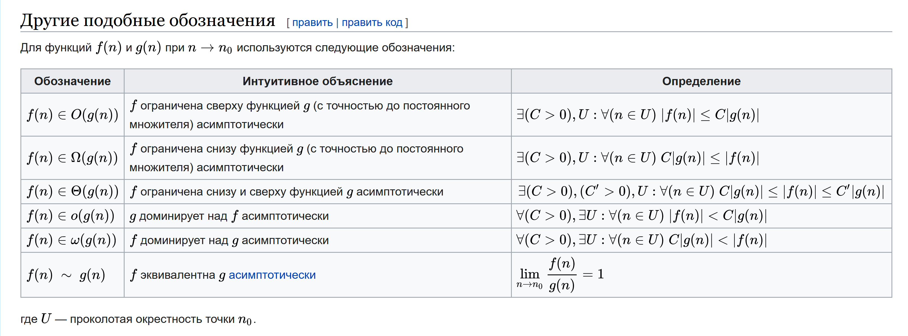
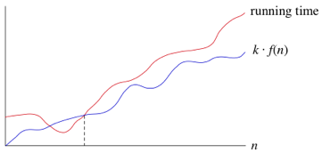
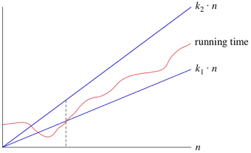

# O-нотация

Big O, Big Omega, Big Theta - это математические обозначения для асимптотического поведения функций. Используются в
математическом анализе и теории алгоритмов. Под асимптотикой понимается характер изменения функции при стремлении её
аргумента к бесконечно большому числу.

Формальное определение всех O нотаций:

## Omega-O

Мы используем Big-Omega (Big-Ω), когда хотим сказать ассимптотически *нижнюю* границу роста функции, то есть алгоритм
займет как минимум столько-то времени.

Так, если сложность алгоритма Ω(g(n)), то для достаточно больших n время выполнения займет как минимум c * g(n)
времени для некоторой константы c.

## Theta-O

Мы используем Big-Theta (Big-θ), когда хотим сказать ассимптотически *точную* сложность алгоритма (tight bound).

Так, если сложность алгоритма Ω(g(n)), то для достаточно больших n время выполнения займет как минимум c1 * g(n) и как
максимум c2 * g(n) времени для некоторых констант c1 и c2.

## Big-O

Мы используем Big-O, когда хотим сказать ассимптотически *верхнюю* границу роста функции, то есть алгоритм займет как
максимум столько-то времени.

Зачастую мы используем как раз Big-O, так как нам интересно только максимальное время работы алгоритма (не путать с
лучшим и худшим случаем).

Например, мы знаем что в худшем случае бинарный поиск работает за время Θ(log2n). Но нельзя сказать что бинарный поиск
работает за Θ(log2n) во всех случаях, включая лучшие случаи. Ведь мы можем найти искомое число и на первой итерации.
Тогда это было бы Θ(1). То есть время выполнения алгоритма никогда не хуже, чем Θ(log2n), но иногда лучше.

То есть, используя Big-O, мы хотим сказать: время выполнения растет как максимум таким образом, но может расти и
медленнее.

Так, если время выполнения O(g(n)), то для достаточно больших n время выполнения займет как максимум c * g(n) для
некоторой константы c.

## Asymptotically tight (Tight bound)

Верно, что время работы бинарного поиска можно описать как O(n^2) или как O(n). Но дело в том, что это будут не точные
ассимптотические оценки.

*Tight bound (Asymptotically tight)* - это такая оценка, которая точно ограничивает время работы функции снизу или
сверху в пределах некоторой константы, но функция g(n) максимально близка по росту к сравниваемой f(n).

Обычно Big-O, Big-Omega, Big-Theta используются именно как ассимптотически точные оценки.

## Little-O, Little-Omega

Существуют Little-O ("o") и Little-Omega ("ω"). Они отличаются тем, что в их формальном определении знак сравнения
строгий и необходимо выполнение условия при любой константе C, а не некоторой. Little-Theta же не существует.

Такие нотации мы используем, когда не можем сказать точную нижнюю или верхнюю границу (loose bound). То есть
сравниваемая функция f(n) всегда будет расти строго быстрее или медленнее, чем g(n). Например, справедливо что время
выполнения бинарного поиска - o(n) и ω(1).

## Пределы

Можно рассмотреть O-нотации с точки зрения пределов.

Если взять две функции f(n) и g(n) при n стремящемся к бесконечности, то предел отношения f(n)/g(n):

- равен 0, если f(n) имеет меньший порядок роста, чем g(n)
- равен c, если f(n) имеет тот же порядок роста, что и g(n)
- равен бесконечности, если f(n) имеет больший порядок роста, чем g(n)

Тогда для Big-O нотаций верно:

1. Для двух первых случаев верно f(n) = O(g(n)) - Big-O
2. Для двух последних случаев f(n) = Ω(g(n)) - Big-Omega
3. Для второго случая f(n) = θ(g(n)) - Big-Theta

А для Little-O нотаций верно:

1. Для первого случая f(n) - o(g(n)) - Little-O
2. для третьего случая f(n) - ω(g(n)) - Little-Omega

Это я взял из книги - вот выдержка из нее:
.png)

## Почему не указывается основание логарифма

Когда мы даем оценку O(log n), мы не указываем основание логарифма потому, что нам важно только поведение функции -
константное, логарифмическое или линейное. Не важно, какое основание. Логарифмическое время всегда лучше линейного.

## Как говорить ассимптотические оценки на английском

- Сама нотация так и говорится - Big-O(h).
- Как давать оценки:
    - O(1) - big oh of one; constant time
    - O(log n) - big oh of log n; logarithmic time
    - O(n) - big oh of N; linear time
    - O(n^2) - big oh of n squared
    - O(2^n) - big oh of power of two
- Случаи: worst case, best case, average case.

## Другое

- Вот полезный сайтик - https://www.bigocheatsheet.com/.
- Посмотри в папке doc файл `o_O.pdf`, там тоже есть полезная инфа.