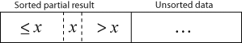

# Алгоритмы сортировок

# Виды алгоритмов

Алгоритмы сортировки характеризуются следующими свойствами:

1. На основе чего - сравнений (comparison sorts) или др.
2. Устойчивая ли сортировка
3. Сортировка на месте - влечет ли создание дополнительной памяти, то есть накладных расходов

# Visualizers:

https://www.toptal.com/developers/sorting-algorithms
https://www.cs.usfca.edu/~galles/visualization
https://airtucha.github.io/SortVis/

# Список и описание алгоритмов

## Сортировка пузырьком (Bubble sort)

Это классика.

Мы проходимся по массиву и сравниваем элементы попарно - если порядок в паре неверный, выполняется перестановка
элементов. Сравнения и перестановки повторяются, пока не дойдем до конца массива. Проходы по массиву повторяются до тех
пор, пока на очередном проходе не окажется, что обмены больше не нужны, что означает что массив отсортирован.

За каждый проход алгоритма по массиву очередной наибольший элемент массива ставится на своё место в конце массива перед
предыдущим «наибольшим элементом», а наименьшие элементы перемещается на одну позицию к началу массива. Отсюда и
название алгоритма - наибольшие элементы всплывают к верху. Таким образом, в конце массива у нас строится
отсортированная последовательность.

Анимация работы алгоритма:


### Сложность

Сложность алгоритма - O(n^2), так как мы делаем n^2 проходов по массиву.

---

## Сортировка выбором (Selection sort)

Идея метода состоит в том, чтобы создавать отсортированную последовательность путем присоединения к ней одного элемента
за другим в правильном порядке.

На каждом проходе по массиву мы выбираем очередной наименьший элемент и ставим его в начало массива за предыдущим
"наименьшим элементом". На каждом шаге внешнего цикла i, последовательность a[0]...a[i] является упорядоченной, то есть
таким образом мы строим отсортированную последовательность в начале массива.

Анимация работы алгоритма (красный - текущий min, желтый - отсортированная последовательность, синий - текущий элемент):


### Сложность

Сложность алгоритма - O(n^2), так как мы делаем n^2 проходов по массиву.

---

## Сортировка вставками (Insertion sort)

Этот алгоритм интересен тем, что может работать в live (online) режиме, то есть по мере поступления данных, а не требует
полного входа.

Идея алгоритма состоит в том, чтобы просматривать каждый элемент по одному и размещать его в подходящее место среди
ранее упорядоченных элементов. Причем эти ранее упорядоченные элементы - не конечная отсортированная последовательность,
а частичная (partial), так как на очередной итерации может найтись еще меньший элемент и встать между какими-то
элементами в этой частично упорядоченной последовательности.

При очередном выполнении внешнего цикла j мы берем новый элемент на позиции j и продвигаем его с помощью свопа к началу
массива, ставя за тем элементом, который меньше его, но перед тем, который больше его. Таким образом, мы будем сдвигать
наименьшие элементы все ближе к началу массива.

То есть, смотри, перед началом работы очередной итерации картина такая:


После итерации так:



Отличие этого алгоритма от сортировки пузырьком в том, что в сортировке пузырьком мы шли по массиву вперед и двигали
наибольший элемент к очередной позиции перед предыдущим "наибольшим элементом", причем его позиция была фиксирована и
больше не менялась, а в конце массива строилась соответственно уже полностью упорядоченная последовательность. Здесь же,
когда мы вставляем очередной элемент в нужное место, совсем не факт, что это именно то нужное место, ведь идя дальше по
внешнему циклу j мы можем найти еще меньший элемент.

Анимация работы алгоритма:


### Сложность

Сложность алгоритма - O(n^2), так как, чтобы поместить каждый новый элемент на свое место мы делаем проход по массиву.

---

## Быстрая сортировка (Quick sort)

Один из самых быстрых известных универсальных алгоритмов сортировки массивов: в среднем работает за время O(n * log n).
Алгоритм относится к виду алгоритмов "Разделяй и властвуй" (Divide and Conquer).

Общая идея алгоритма состоит в следующем:

Выбрать из массива элемент, называемый опорным. Это может быть любой из элементов массива. От выбора опорного элемента
не зависит корректность алгоритма, но в отдельных случаях может сильно зависеть его эффективность (см. ниже). Сравнить
все остальные элементы с опорным и переставить их в массиве так, чтобы разбить массив на два непрерывных отрезка,
следующих друг за другом: «элементы меньшие опорного» и «равные или большие». Для обоих отрезков значений рекурсивно
выполнить ту же последовательность операций, если длина отрезка больше единицы. Чем ниже мы спускаемся по рекурсии вниз,
тем больше нужные элементы сдвигаются в нужные стороны - меньшие элементы - влево, большие - вправо. Когда мы придем к
базовому случаю рекурсии - отрезкам из 1 элемента, то это значит, что мы отсортировали весь массив.

Пример работы алгоритма, допустим что мы просто выбираем средний элемент отрезка в качестве опорного (выделен жирным
цветом):


Вот псевдокод алгоритма:

```
algorithm quicksort(A, low, high) is
   if low < high then
      p:= partition(A, low, high)
      quicksort(A, low, p)
      quicksort(A, p + 1, high)
```

Функция partition отвечает за то, чтобы переставить элементы в массиве так, чтобы разбить массив на два непрерывных
отрезка, следующих друг за другом: «элементы меньшие опорного» и «равные или большие». Функция возвращает индекс
опорного элемента. От этой функции полностью зависит эффективность алгоритма. Существует несколько вариаций этой
функции.

### Разбиение Ломуто

Данный алгоритм разбиения был предложен Нико Ломуто. В данном алгоритме опорным выбирается последний элемент. Алгоритм
хранит индекс разбиения в переменной i. Каждый раз, когда находится элемент, меньше или равный опорному, индекс
увеличивается, и элемент вставляется перед опорным. Хоть эта схема разбиения проще и компактнее, чем схема Хоара, она
менее эффективна и используется только в обучающих материалах. Сложность данной быстрой сортировки возрастает до O(n2),
когда массив уже отсортирован или все его элементы равны.

Псевдокод:

```
algorithm partition(A, low, high) is
    pivot := A[high]
    i := low
    for j := low to high - 1 do
        if A[j] ≤ pivot then
            swap A[i] with A[j]
            i := i + 1
    swap A[i] with A[high]
    return i
```

### Сложность алгоритма

В лучшем случае, если мы каждый раз будем удачно выбирать опорный элемет и разделять отрезки на 2 равные части, то
глубина рекурсии будет log2(n), прежде чем мы достигнем базового случая из единичного отрезка. На каждом уровне рекурсии
на разделение всех отрезов нам потребуется всего O(n) времени. Соответственно, время работы алгоритма - O(n * log n).

В среднем случае тоже получается O(n * log n), так как глубина рекурсии будет таким же логарифмом, просто с другим
основанием.

В худшем случае каждое разделение даёт два подмассива размерами 1 и n-1, то есть при каждом рекурсивном вызове отрезок
будет на 1 короче, чем в предыдущий раз. Такое может произойти, если в качестве опорного на каждом этапе будет выбран
элемент либо наименьший, либо наибольший из всех обрабатываемых. Например, если в качестве опорного выбирать первый или
последний элемент, то такой эффект даст уже отсортированный массив. Тогда время будет O(n^2).

### Достоинства алгоритма

- Один из самых быстродействующих (на практике) из алгоритмов внутренней сортировки
- Допускает естественное распараллеливание (сортировка выделенных подмассивов в параллельно выполняющихся подпроцессах).

### Недостатки алгоритма

- Сильно деградирует по скорости в O(n^2) в худшем или близком к нему случае, что может случиться при неудачных входных
  данных
- Прямая реализация в виде функции с двумя рекурсивными вызовами может привести к ошибке переполнения стека, так как в
  худшем случае ей может потребоваться сделать O(n) вложенных рекурсивных вызовов

### Улучшения алгоритма

Улучшения алгоритма на исправление перечисленных недостатков.

1. Деградация по скорости в случае неудачного набора входных данных решается по двум разным направлениям: снижение
   вероятности возникновения худшего случая путём специального выбора опорного элемента и применение различных
   технических приёмов, обеспечивающих устойчивую работу на неудачных входных данных. Для первого направления:
    - Выбор среднего элемента. Устраняет деградацию для предварительно отсортированных данных, но оставляет возможность
      случайного появления или намеренного подбора «плохого» массива.
    - Выбор медианы из трёх элементов: первого, среднего и последнего. Снижает вероятность возникновения худшего случая,
      по сравнению с выбором среднего элемента.
    - Случайный выбор. Вероятность случайного возникновения худшего случая становится исчезающе малой, а намеренный
      подбор — практически неосуществимым. Ожидаемое время выполнения алгоритма сортировки составляет O(n log n).

2. Во избежание отказа программы из-за большой глубины рекурсии могут применяться следующие методы:
    - При достижении нежелательной глубины рекурсии переходить на сортировку другими методами, не требующими рекурсии.
      Примером такого подхода является алгоритм Introsort или некоторые реализации быстрой сортировки в библиотеке STL.
      Можно заметить, что алгоритм очень хорошо подходит для такого рода модификаций, так как на каждом этапе позволяет
      выделить непрерывный отрезок исходного массива, предназначенный для сортировки, и то, каким методом будет
      отсортирован этот отрезок, никак не влияет на обработку остальных частей массива.

---

## Introsort

**Introsort** — алгоритм сортировки, который использует в основе быструю сортировку и переключается на пирамидальную
сортировку, когда глубина рекурсии превысит некоторый заранее установленный уровень (например, логарифм от числа
сортируемых элементов). Этот подход сочетает в себе достоинства обоих методов с худшим случаем O(n log n) и
быстродействием, сравнимым с быстрой сортировкой. Так как оба алгоритма используют сравнения, этот алгоритм также
принадлежит классу сортировок на основе сравнений.

---

## Сортировка слиянием (Merge sort)

Идея сортировки слиянием заключается в том, чтобы собирать отсортированный массив из отсортированных отрезок меньшего
размера. Этот алгоритм относится к виду алгоритмов Divide and Conquer.

Алгоритм:

1. Сортируемый массив разбивается на две части одинакового размера
2. Каждая из получившихся частей сортируется рекурсивно
3. Два упорядоченных массива половинного размера соединяются в один

Базовый случай рекурсии - отрезок длиной 1.

Изображение работы алгоритма:


Анимация работы алгоритма:


Для улучшения работы алгоритма, часто, как и в случае с Quick sort, применяется другой алгоритм сортировки для отрезков
малого размера.

### Сложность

Сложность алгоритма - O(n * log n).

### Достоинства

- Работает даже на структурах данных последовательного доступа
- Неплохо работает в параллельном варианте: легко разбить задачи между процессорами поровну, но трудно сделать так,
  чтобы другие процессоры взяли на себя работу, в случае если один процессор задержится.
- Не имеет «трудных» входных данных, работает за O(n * log n) даже в худшем случае

### Недостатки

- Работает чуть медленнее чем Quick sort

---

## Timsort

Timsort — гибридный алгоритм сортировки, сочетающий сортировку вставками и сортировку слиянием, опубликованный в 2002
году Тимом Петерсом. В настоящее время Timsort является стандартным алгоритмом сортировки в Python, OpenJDK 7 и др.
Основная идея алгоритма в том, что в реальном мире сортируемые массивы данных часто содержат в себе упорядоченные
подмассивы. На таких данных Timsort существенно быстрее многих алгоритмов сортировки.

Сильно разбирать его не буду - очевидно, что всяких модификаций сортировок очень много, и рассматривать их нет смысла.
Алгоритмы сортировки в языках почти никогда не имплементированы в их чистом виде - всегда есть какие-то модификации или
смешения алгоритмов в зависимости от размера входных данных.

---

## Tree Sort

**Сортировка с помощью двоичного дерева поиска (Tree Sort)** — алгоритм сортировки, заключающийся в построении двоичного
дерева поиска по ключам массива, с последующей сборкой результирующего отсортированного массива путём обхода узлов
построенного дерева в in-order порядке следования ключей. Данная сортировка является оптимальной при получении данных в
online режиме.

### Алгоритм

1. Построение двоичного дерева
2. Сборка результирующего массива путём обхода узлов в необходимом порядке следования ключей: In-Order (LNR) даст нам
   неубывающий порядок

### Сложность

Процедура добавления объекта в бинарное дерево имеет среднюю алгоритмическую сложность порядка O(log n). Соответственно,
для n объектов сложность будет составлять O(n * log n), что относит сортировку с помощью двоичного дерева к группе
«быстрых сортировок».

Однако, сложность добавления объекта в несбалансированное дерево может достигать O(n), что может привести к общей
сложности O(n^2).

---

## Heap Sort

Heap Sort выполняется за время O(n * log n) на месте, но требует построения кучи из исходного массива.

Идея работы алгоритма. Мы знаем, что первый элемент кучи - это корень, где всегда лежит максимальный элемент. Если
обменять корень с последним элементом, то в конце массива будет лежать максимальный элемент из кучи. Если после этого
исключить последний элемент из кучи, то есть уменьшить размер кучи на 1, то первые N-1 элементов кучи будут
удовлетворять свойству кучи, кроме, возможно, корня. Но мы можем вызвать down-heapify на корне и снова восстановить
свойство кучи, после чего в корне будет лежать наибольшее значение из всех оставшихся элементов кучи. Мы снова
обмениваем корень с последним элементом и повторяем те же самые действия. В итоге, когда после множества повторений
элементов в куче больше не останется, мы получим отсортированный массив.

### Сложность

Время работы алгоритма - `O(n * log n) + O(n * log n)`. Первая часть - это построение кучи. Вторая - собственно сама
тренировка - мы вызываем heapify ровно n раз, а сложность heapify - O(log n). Однако ассимптотически все это сводится к
`O(n * log n)`.