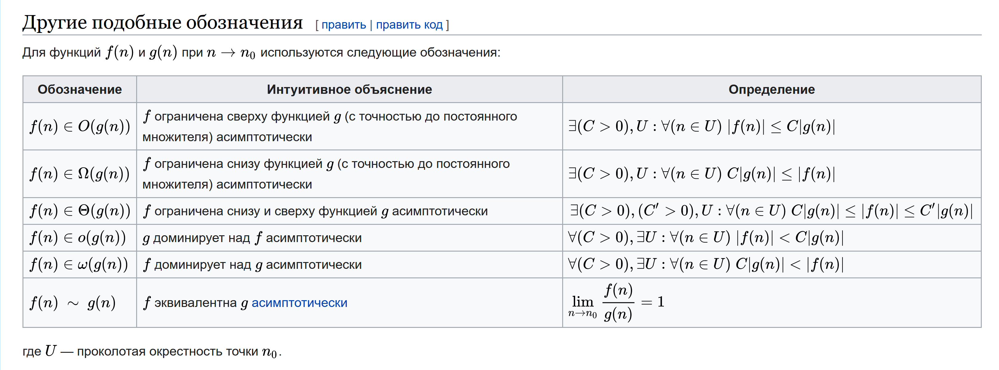
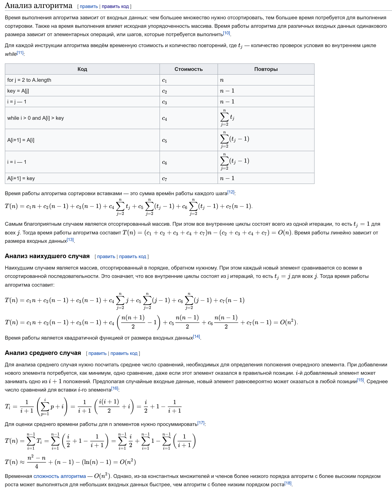
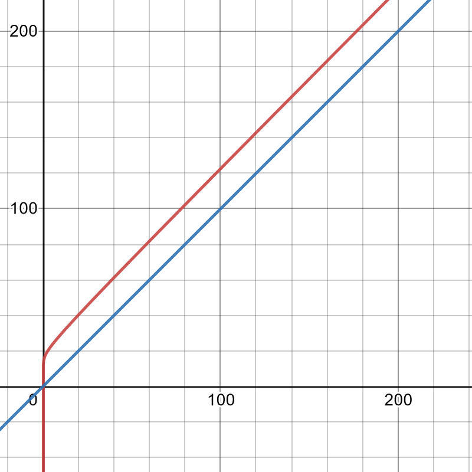
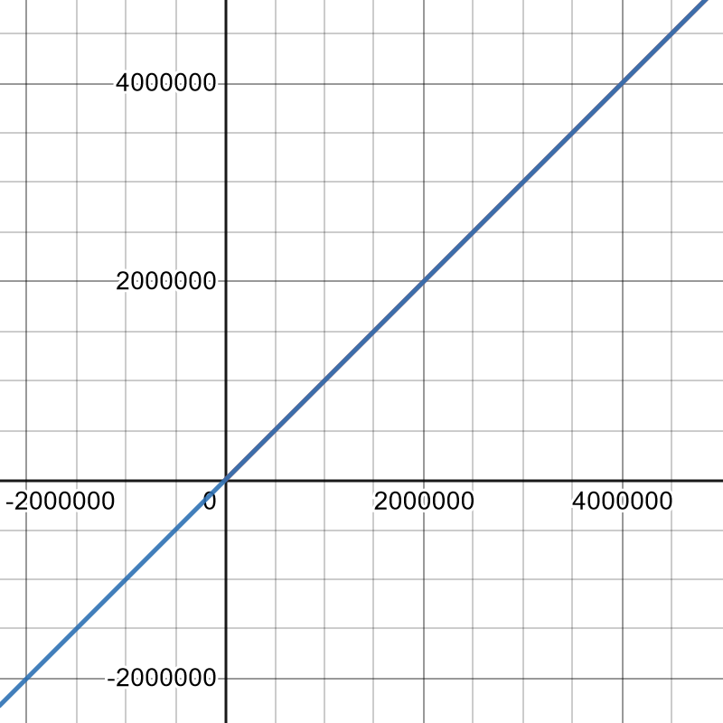
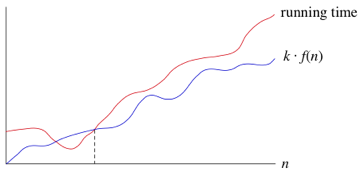
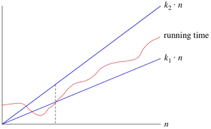
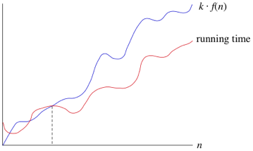

# O-нотация

**Содержание:**
- [Описание](#описание)
    - [O-нотация и алгоритмы](#o-нотация-и-алгоритмы)
    - [Отбрасывание non-dominant слагаемых](#отбрасывание-non-dominant-слагаемых)
    - [Логарифм в асимптотике](#логарифм-в-асимптотике)
- [Omega-O](#omega-o)
    - [Формальное определение](#формальное-определение)
- [Theta-O. Asymptotically Tight Bound](#theta-o-asymptotically-tight-bound)
    - [Формальное определение](#формальное-определение-1)
- [Big-O](#big-o)
    - [Формальное определение](#формальное-определение-2)
- [Sharp bound](#sharp-bound)
- [Little-O, Little-Omega](#little-o-little-omega)
- [Пределы](#пределы)
- [Как произносить асимптотические оценки на английском](#как-произносить-асимптотические-оценки-на-английском)
- [Полезные ресурсы](#полезные-ресурсы)

---

## Описание

$\text{Big O, Big Omega, Big Theta}$ - это математические обозначения для асимптотического поведения функций, также известные как O-нотации. Под асимптотикой понимается характер изменения функции при стремлении её аргумента к бесконечно большому числу. O-нотация активно применяется в математическом анализе и теории алгоритмов.

Формальное определение всех O-нотаций:

### O-нотация и алгоритмы

При оценке алгоритмов нам понадобятся O-нотации, чтобы определять эффективность алгоритма в плане скорости работы или
требуемой дополнительной памяти. Важно понять, что эти обозначения не сообщают *точной* времени работы алгоритма - они
лишь показывают *порядок роста* (order of growth) времени или памяти в зависимости от входных данных.

В зависимости от нотации, мы можем сказать нижнюю, верхнюю или обе границы порядка роста функции. Так, Big-O сообщает верхнюю, Big-Omega - нижнюю, а Big-Theta ограничивает функцию как сверху, так и снизу.

Таким образом, O-нотация разделяет алгоритмы на классы эффективности, например: $O(\log n)$, $O(n)$, $O(n * \log n)$, $O(n^2)$ и так далее.

Здесь $n$ - это размер входных данных. Например, мы говорим, что линейный поиск (linear search) относится к классу $O(n)$, потому что его время работы возрастает линейно в зависимости от входных данных. Если мы увеличим размер входных данных, например, с $n$ до $2n$, то и время работы вырастет в 2 раза. А вот если алгоритм работает за время $O(n^2)$, то при увеличении $n$ до $2n$, время работы вырастет в 4 раза.

Как же нам оценить время работы алгоритма в терминах O-нотации? Для этого нам нужно составить функцию, которая считает
точное количество операций алгоритма.

Например, в Википедии хорошо разобран алгоритм "Сортировка вставками" - приведу скриншот из статьи.

    
Оценка количества операций для сортировки вставками

Не пугайтесь: здесь разобрано очень подробно, но на самом деле все проще. Достаточно изучив и поняв эту тему, вы сможете интуитивно вычислять время работы, понимая что делает каждый шаг алгоритма.

---

### Отбрасывание non-dominant слагаемых

Как я уже сказал, используя асимптотические обозначения, мы хотим показать *порядок роста* функции. Что это значит на
деле? Это значит, что мы отбрасываем:
1. Недоминирующие (non-dominant) слагаемые из функции: меньшие степени и константы (constants)
2. Константные множители

Например, если мы оценили, что количество операций алгоритма можно описать такой функцией: $f(n)=5n^2 + n + 10$, то в
итоге мы равно говорим, что эта функция принадлежит к классу $O(n^2)$. Почему же так?

Дело в том, что на достаточно больших входных данных все эти множители и не доминирующие слагаемые *перестают играть
значимую роль*. А асимптотика дает оценку роста функции при стремлении ее аргумента к *бесконечному числу*.

Например, давайте сравним рост функций $f(x)=x+\log(x)+16$ и $g(x)=x$, нарисовав их графики. Это на маленьких $x$:

Да, первая функция пока что обходит вторую. А теперь давайте возьмем масштаб поменьше и посмотрим на их рост еще раз:

Мы видим, что их графики уже сравнялись и совершенно не отличимы. Да, конечно, первая функция будет все еще больше, но
вопрос в том, *насколько значительно*. Здесь мы понимаем, что на достаточно больших n основную роль играет только
доминирующее слагаемое из всей функции.

---

### Логарифм в асимптотике

Когда мы даем асимптотическую оценку, мы не указываем основание логарифма.

Это потому, что нам важно только поведение функции: константное, логарифмическое или линейное. Не важно, какое основание
логарифма, важно то, что *логарифмическое время всегда лучше линейного*.

---

## Omega-O

Мы используем $\text{Big-Omega}$ ($\text{Big-}\Omega$), когда хотим сказать асимптотически *нижнюю* границу роста функции, то есть алгоритм
займет *как минимум* столько-то времени.

### Формальное определение

$f(n)=\Omega(g(n))$ тогда и только тогда, когда существует некоторая положительная константа $c$ и некоторое неотрицательное
число $n_0$, такие что $f(n) >= c*g(n)$ для всех $n >= n_0$.

То есть, если сложность алгоритма $\Omega(g(n))$, то для достаточно больших n время выполнения займет как минимум $c * g(n)$.

---

## Theta-O. Asymptotically Tight Bound

Мы используем $\text{Big-Theta}$ ($\text{Big-}\Theta$), когда хотим сказать *асимптотически точную* сложность алгоритма (asymptotically tight bound).

Так, если сложность алгоритма $\Theta(g(n))$, то для достаточно больших n время выполнения займет как минимум $c1 * g(n)$ и как максимум $c2 * g(n)$ времени для некоторых констант c1 и c2.

### Формальное определение

Верно, что если $f(n) = \Theta(g(n))$, то $f(n) = \Omega(g(n))$ и $f(n) = O(g(n))$.

И верно обратное: если $f(n) = \Omega(g(n))$ и $f(n) = O(g(n))$, то $f(n) = \Theta(g(n))$.

---

## Big-O

Мы используем Big-O, когда хотим сказать асимптотически *верхнюю* границу роста функции, то есть алгоритм займет как
максимум столько-то времени.

Зачастую мы используем как раз Big-O, так как нам интересно только максимальное время работы алгоритма - не путать с
лучшим и худшим случаем входных данных.

Например, мы знаем что в худшем случае бинарный поиск работает за время $\Theta(log2n)$. Но нельзя сказать что бинарный поиск
работает за $\Theta(log2n)$ во всех случаях, включая лучшие случаи. Ведь мы можем найти искомое число и на первой итерации.
Тогда это было бы $\Theta(1)$. То есть время выполнения алгоритма никогда не хуже, чем $\Theta(log2n)$, но иногда лучше.

То есть, используя Big-O, мы хотим сказать: время выполнения растет как максимум таким образом, но может расти и
медленнее.

### Формальное определение

$f(n)=O(g(n))$ тогда и только тогда, когда существует некоторая положительная константа $c$ и некоторое неотрицательное
число $n_0$, такие что $f(n) <= c*g(n)$ для всех $n >= n_0$.

Так, если время выполнения O(g(n)), то для достаточно больших n время выполнения займет как максимум c * g(n).

---

## Sharp bound

Верно, что время работы бинарного поиска можно описать как $O(n^2)$ или как $O(n)$. Но дело в том, что это будут не максимально точные асимптотические оценки.

Когда мы используем Big-O нотации, мы стараемся давать максимально точные асимптотические оценки (sharp bound, tightest bound). То есть такую оценку, которая точно ограничивает время работы функции $f$ снизу или сверху в пределах некоторой константы, но по росту максимально близка к рассматриваемой функции и эту оценку нельзя улучшить.

---

## Little-O, Little-Omega

Существуют Little-O ($o$) и Little-Omega ($\omega$). Они отличаются от больших (Big) нотаций тем, что в их формальном определении знак сравнения строгий и необходимо выполнение условия при любой константе $C$, а не некоторой. Little-Theta же не существует.

Такие нотации мы используем, когда не можем сказать точную нижнюю или верхнюю границу, а говорим про loose bound. То есть: сравниваемая функция $f(n)$ всегда растет *строго быстрее или медленнее*, чем $g(n)$. Например, справедливо что время выполнения бинарного поиска - $o(n)$ и $\omega(1)$.

---

## Пределы

Можно рассмотреть O-нотации с точки зрения пределов.

Если взять две функции f(n) и g(n) при n стремящемся к бесконечности, то предел отношения f(n)/g(n):

- равен 0, если f(n) имеет меньший порядок роста, чем g(n)
- равен c, если f(n) имеет тот же порядок роста, что и g(n)
- равен бесконечности, если f(n) имеет больший порядок роста, чем g(n)

Тогда для Big-O нотаций верно:

1. Для двух первых случаев $f(n) = O(g(n))$
2. Для двух последних случаев $f(n) = \Omega(g(n))$
3. Для второго случая $f(n) = \Theta(g(n))$

А для Little-O нотаций верно:

1. Для первого случая $f(n) - o(g(n))$
2. для третьего случая $f(n) - \omega(g(n))$

Это я взял из книги - вот выдержка из нее:

.png)

---

## Как произносить асимптотические оценки на английском

- Сами нотация так и произносятся - Big-O(h), Big-Omega, Big-Theta
- Как давать оценки:
    - $O(1)$ - big oh of one; constant time
    - $O(\log n)$ - big oh of log n; logarithmic
    - $O(n)$ - big oh of N; linear time
    - $O(n^2)$ - big oh of n squared; quadratic
    - $O(2^n)$ - big oh of power of two; exponential
- Случаи: worst case, best case, average case

---

## Полезные ресурсы

- Полезный сайт с оценками всех популярных алгоритмов - <https://www.bigocheatsheet.com/>
- В этой директории есть файл `o_O.pdf` - это конспект уроков линейной алгебры и математического анализа из ВШЭ
