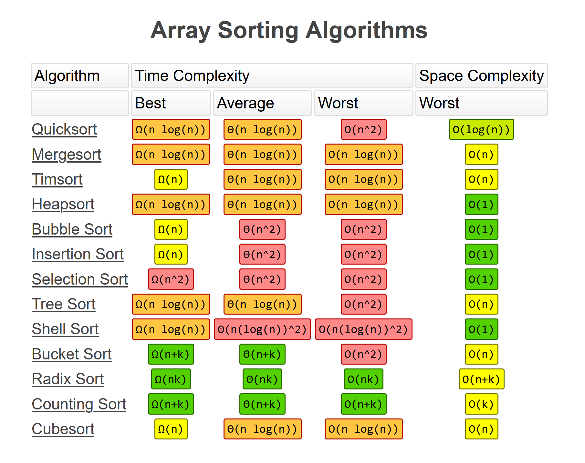
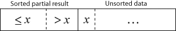
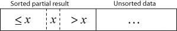
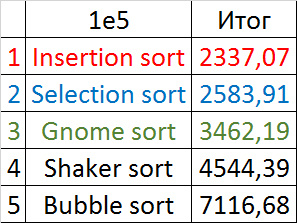
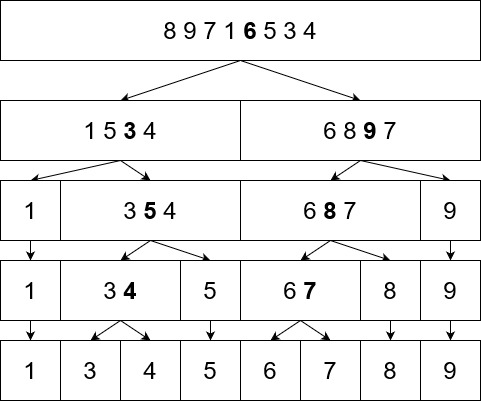
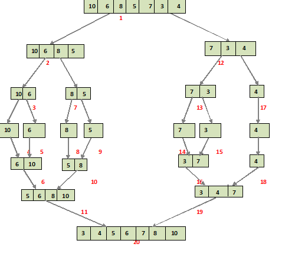

# Алгоритмы сортировок

# Виды алгоритмов

Алгоритмы сортировки характеризуются следующими свойствами:

1. На основе чего - сравнений (comparison sorts) или нет
2. Устойчивая ли сортировка
3. Сортировка на месте - влечет ли создание дополнительной памяти, то есть накладных расходов
4. Насколько активно задействуется кэш процессора (locality of reference и т.п.)

# Visualizers:

- https://www.toptal.com/developers/sorting-algorithms
- https://www.cs.usfca.edu/~galles/visualization
- https://airtucha.github.io/SortVis/

# Сложность популярных алгоритмов



# Полезные ссылки

- [Wiki: Алгоритм сортировки](https://ru.wikipedia.org/wiki/%D0%90%D0%BB%D0%B3%D0%BE%D1%80%D0%B8%D1%82%D0%BC_%D1%81%D0%BE%D1%80%D1%82%D0%B8%D1%80%D0%BE%D0%B2%D0%BA%D0%B8)
- Репозиторий с имплементациями алгоритмов сортировки на Java - https://github.com/TheAlgorithms/Java/tree/master/src/main/java/com/thealgorithms/sorts
- Сравнение производительности различных алгоритмов - https://habr.com/ru/post/335920/

# Список и описание алгоритмов

Далее рассмотрим все необходимые для понимания алгоритмы сортировки.

Перед началом приведу цитату Дональда Кнутта:
> It would be nice if only one or two of the sorting methods would dominate all of the others, regardless of application or the computer being used. But in fact, each method has its own peculiar virtues. [...] Thus we find that nearly all of the algorithms deserve to be remembered, since there are some applications in which they turn out to be best. — Donald Knuth, The Art Of Computer Programming, Volume 3

# Медленные сортировки - O(n^2)

Здесь посмотрим на медленные сортировки, работающие за O(n^2).

## Сортировка пузырьком (Bubble sort)

Это классика.

Мы проходимся по массиву и сравниваем элементы попарно - если порядок в паре неверный, выполняется перестановка
элементов. Сравнения и перестановки повторяются, пока не дойдем до конца массива. Проходы по массиву повторяются до тех
пор, пока на очередном проходе не окажется, что обмены больше не нужны, что означает что массив отсортирован.

За каждый проход алгоритма по массиву очередной наибольший элемент массива ставится на своё место в конце массива перед
предыдущим «наибольшим элементом», а наименьшие элементы перемещается на одну позицию к началу массива. Отсюда и
название алгоритма - наибольшие элементы всплывают к верху (bubble up). Таким образом, в конце массива у нас строится
отсортированная последовательность.

Анимация работы алгоритма:


### Характеристики

- **Категория алгоритма:** *exchange sorts*, потому что алгоритм основан на перестановке элементов.

### Сложность

Сложность алгоритма - O(n^2), так как мы делаем n^2 проходов по массиву.

---

## Сортировка выбором (Selection sort)

Идея метода состоит в том, чтобы создавать отсортированную последовательность путем присоединения к ней одного элемента
за другим в правильном порядке.

На каждом проходе по массиву мы выбираем очередной наименьший элемент и ставим его в начало массива за предыдущим
"наименьшим элементом". На каждом шаге внешнего цикла i, последовательность a[0]...a[i] является упорядоченной, то есть
таким образом мы строим отсортированную последовательность в начале массива.

Анимация работы алгоритма (красный - текущий min, желтый - отсортированная последовательность, синий - текущий элемент):


### Характеристики

- **Категория алгоритма:** *selection sorts*, потому что алгоритм основан на выборе очередного элемента и вставке в
  отсортированную последовательность

### Сложность

Сложность алгоритма - O(n^2), так как мы делаем n^2 проходов по массиву.

---

## Сортировка вставками (Insertion sort)

Идея алгоритма состоит в том, чтобы просматривать каждый элемент по одному и размещать его в подходящее место среди ранее упорядоченных элементов. Из этого следует, что эти ранее упорядоченные элементы - не конечная отсортированная последовательность, а частичная (partial), так как на очередной итерации может найтись еще меньший элемент и встать между какими-то элементами в этой частично упорядоченной последовательности.

При очередном выполнении внешнего цикла j мы берем новый элемент на позиции j и продвигаем его с помощью свопа к началу массива на нужное место k, такое что, `a[k-1] < a[k] < a[k+1]`. Таким образом, мы будем сдвигать наименьшие элементы все ближе к началу массива.

То есть, смотри, перед началом работы очередной итерации картина такая (текущий элемент это x):



После итерации уже так:



Анимация работы алгоритма:


### Характеристики

- **Категория алгоритма:** *insertion sorts*, потому что алгоритм основан на вставке элемента
- Может работать в online режиме, то есть в режиме реального времени, и сортировать элементы по мере их поступления. Это возможно потому, что алгоритм находит нужное место здесь и сейчас, умея вставлять элементы внутрь уже отсортированной последовательности. То есть, алгоритм сортировки вставками не зависит от предыдущих шагов алгоритма - это похоже на жадное программирование (greedy programming)

### Сложность

Сложность алгоритма - O(n^2), так как, чтобы поместить каждый новый элемент на свое место мы делаем проход по массиву.

---

## Отличие Insertion Sort от Selection Sort

В Insertion Sort, когда мы ставим очередной элемент на нужное место, мы не уверены, что это конечное место.
Причем, в начале или конце массива действительно образуется отсортированная последовательность. Но все дело в том, что
при взятии очередного элемента мы можем вставить его *между* какими-то элементами в этой отсортированной
последовательности, так как новый элемент может оказаться еще меньшим/большим, чем все встретившиеся раньше. 
В Selection Sort же при взятии очередного наименьшего/наибольшего элемента, мы просто аппендим его к отсортированной
последовательности и мы знаем, что то место, куда мы его поставили - конечное.

То есть, смотри, еще проще:

- Insertion: вставка в нужное место здесь и сейчас, возможно *между* элементами
- Selection: аппенд к полностью отсортированной последовательности

---

## Bubble vs Selection vs Insertion Sor

Итак, мы рассмотрели три медленных алгоритма сортировки работающих за O(n^2). Какой же из них лучше и имеют ли они
применение в реальной жизни?

Как ни странно, insertion sort используется и в реальной жизни. Однако, используется только на массивах (отрезках)
маленьких размеров, где как показывает аналитика, этот алгоритм отрабатывают даже быстрее чем быстрые сортировки.

Вот результаты сравнения времени работы - взял из https://habr.com/ru/post/335920/:



--- 

# Быстрые сортировки - O(n * log n)

Быстрые сортировки - это множество алгоритмов сортировки, которые работают за время O(n * log n). Давайте разберем их.

Чаще всего используются 3 из них - quick sort, merge sort, heap sort, а также гибридные сортировки.

---

## Быстрая сортировка (Quick sort)

**Быстрая сортировка** - один из самых быстрых известных универсальных алгоритмов сортировки массивов: в среднем
работает за время O(n * log n). Алгоритм относится к виду алгоритмов "Разделяй и властвуй" (Divide and Conquer).

Общая идея алгоритма состоит в следующем:

Выбрать из массива элемент, называемый опорным. Это может быть любой из элементов массива. От выбора опорного элемента
не зависит корректность алгоритма, но в отдельных случаях может сильно зависеть его эффективность (см. ниже). Сравнить
все остальные элементы с опорным и переставить их в массиве так, чтобы разбить массив на два непрерывных отрезка,
следующих друг за другом: «элементы меньшие опорного» и «равные или большие». Для обоих отрезков значений рекурсивно
выполнить ту же последовательность операций, если длина отрезка больше единицы. Чем ниже мы спускаемся по рекурсии вниз,
тем больше нужные элементы сдвигаются в нужные стороны - меньшие элементы - влево, большие - вправо. Когда мы придем к
базовому случаю рекурсии - отрезкам из 1 элемента, то это значит, что мы отсортировали весь массив.

Пример работы алгоритма, допустим что мы просто выбираем средний элемент отрезка в качестве опорного (выделен жирным
цветом):



Вот псевдокод алгоритма:

```
algorithm quicksort(A, low, high) is
   if low < high then
      p:= partition(A, low, high)
      quicksort(A, low, p)
      quicksort(A, p + 1, high)
```

Функция partition отвечает за то, чтобы переставить элементы в массиве так, чтобы разбить массив на два непрерывных
отрезка, следующих друг за другом: «элементы меньшие опорного» и «равные или большие». Функция возвращает индекс
опорного элемента. От этой функции полностью зависит эффективность алгоритма. Существует несколько вариаций этой
функции.

### Разбиение Ломуто

Данный алгоритм разбиения был предложен Нико Ломуто. В данном алгоритме опорным выбирается последний элемент. Алгоритм
хранит индекс разбиения в переменной i. Каждый раз, когда находится элемент, меньше или равный опорному, индекс
увеличивается, и элемент вставляется перед опорным. Хоть эта схема разбиения проще и компактнее, чем схема Хоара, она
менее эффективна и используется только в обучающих материалах. Сложность данной быстрой сортировки возрастает до O(n2),
когда массив уже отсортирован или все его элементы равны.

Псевдокод:

```
algorithm partition(A, low, high) is
    pivot := A[high]
    i := low
    for j := low to high - 1 do
        if A[j] ≤ pivot then
            swap A[i] with A[j]
            i := i + 1
    swap A[i] with A[high]
    return i
```

### Характеристики

- **Категория алгоритма:** *exchange sorts*, потому что алгоритм основан на перестановке элементов

### Сложность

В лучшем случае, если мы каждый раз будем удачно выбирать опорный элемет и разделять отрезки на 2 равные части, то
глубина рекурсии будет log2(n), прежде чем мы достигнем базового случая из единичного отрезка. На каждом уровне рекурсии
на разделение всех отрезов нам потребуется всего O(n) времени. Соответственно, время работы алгоритма - O(n * log n).

В среднем случае тоже получается O(n * log n), так как глубина рекурсии будет таким же логарифмом, просто с другим
основанием.

В худшем случае каждое разделение даёт два подмассива размерами 1 и n-1, то есть при каждом рекурсивном вызове отрезок
будет на 1 короче, чем в предыдущий раз. Такое может произойти, если в качестве опорного на каждом этапе будет выбран
элемент либо наименьший, либо наибольший из всех обрабатываемых. Например, если в качестве опорного выбирать первый или
последний элемент, то такой эффект даст уже отсортированный массив. Тогда время будет O(n^2).

### Память

Хотя Quick Sort работает in-place, но она все равно требует O(log n) памяти на поддержание колл стека.

### Достоинства алгоритма

- Один из самых быстродействующих (на практике) из алгоритмов внутренней сортировки
- Допускает естественное распараллеливание (сортировка выделенных подмассивов в параллельно выполняющихся подпроцессах).

### Недостатки алгоритма

- Сильно деградирует по скорости в O(n^2) в худшем или близком к нему случае, что может случиться при неудачных входных
  данных
- Прямая имплементация в виде функции с двумя рекурсивными вызовами может привести к ошибке переполнения стека, так как в
  худшем случае ей может потребоваться сделать O(n) вложенных рекурсивных вызовов

### Улучшения алгоритма

Улучшения алгоритма на исправление перечисленных недостатков.

1. Деградация по скорости в случае неудачного набора входных данных решается по двум разным направлениям: снижение
   вероятности возникновения худшего случая путём специального выбора опорного элемента и применение различных
   технических приёмов, обеспечивающих устойчивую работу на неудачных входных данных. Для первого направления:
    - Выбор среднего элемента. Устраняет деградацию для предварительно отсортированных данных, но оставляет возможность
      случайного появления или намеренного подбора «плохого» массива.
    - Выбор медианы из трёх элементов: первого, среднего и последнего. Снижает вероятность возникновения худшего случая,
      по сравнению с выбором среднего элемента.
    - Случайный выбор. Вероятность случайного возникновения худшего случая становится исчезающе малой, а намеренный
      подбор — практически неосуществимым. Ожидаемое время выполнения алгоритма сортировки составляет O(n log n).

2. Во избежание отказа программы из-за большой глубины рекурсии могут применяться следующие методы:
    - При достижении нежелательной глубины рекурсии переходить на сортировку другими методами, не требующими рекурсии.
      Примером такого подхода является алгоритм Introsort или некоторые имплементации быстрой сортировки в библиотеке STL.
      Можно заметить, что алгоритм очень хорошо подходит для такого рода модификаций, так как на каждом этапе позволяет
      выделить непрерывный отрезок исходного массива, предназначенный для сортировки, и то, каким методом будет
      отсортирован этот отрезок, никак не влияет на обработку остальных частей массива.

---

## Introsort

**Introsort** — алгоритм сортировки, который использует в основе быструю сортировку и переключается на пирамидальную
сортировку, когда глубина рекурсии превысит некоторый заранее установленный уровень (например, логарифм от числа
сортируемых элементов). Этот подход сочетает в себе достоинства обоих методов с худшим случаем O(n log n) и
быстродействием, сравнимым с быстрой сортировкой. Так как оба алгоритма используют сравнения, этот алгоритм также
принадлежит классу сортировок на основе сравнений.

### Характеристики

- **Категория алгоритма:** *hybrid sorts*, потому что алгоритм смешивает в себе несколько разных сортировок

---

## Сортировка слиянием (Merge sort)

Идея сортировки слиянием заключается в том, чтобы собирать отсортированный массив из отсортированных отрезок меньшего
размера. Этот алгоритм относится к виду алгоритмов Divide and Conquer.

Алгоритм:

1. Сортируемый массив разбивается на две части одинакового размера
2. Каждая из получившихся частей сортируется рекурсивно
3. Два упорядоченных массива половинного размера соединяются в один

Базовый случай рекурсии - отрезок массива длиной 1.

Изображение работы алгоритма:



Анимация работы алгоритма:


То есть, идея заключается в том, чтобы собирать уже отсортированные подмассивы в один отсортированный. А начинаем мы
собирать только тогда, когда дошли до последнего уровня рекурсии, т.е. базового случая - подмассива длины 1, который
считается уже отсортированным. Тогда мы берем подмассивы длиной 1 и собираем их в один отсортированный, длиной 2, и так
далее. Таким образом, поднимаясь обратно по дереву вызовов мы каждый раз получаем отсортированные подмассивы все большей длины,
пока на верхнем уровне нам не останется объединить два отсортированных подмассива длины N/2 и получить один
отсортированный массив длины N.

### Характеристики

- **Категория алгоритма:** *merge sorts*, потому что алгоритм основан на слиянии элементов

### Сложность

Сложность алгоритма - `O(n * log n)`.

Доказать эту сложность можно через Мастер Теорему, по которой у меня уже есть статья, где в качестве примера я разбираю
сложность merge sort. Однако, и без этого интуитивно понятно, что на каждом уровне дерева вызовов нам нужно линейно
проходиться по всем подмассивам, общая длина которых равна N; получается, что на каждом уровне мы тратим O(n) времени.
Остается помножить это на количество уровней дерева вызовов, что есть log n, и мы получаем сложность O(n * log n).

### Память

Merge Sort требует `O(n)` дополнительной памяти.

Понимаю, что это совсем не очевидно с ходу. Казалось бы, ведь при мердже двух отсортированных подмассивов мы копируем
их, и делаем это с каждым из подмассивов на каждом уровне дерева вызовов, в общем выделяя ровно N памяти на каждом
уровне. Значит мы должны были выделить всего O(n * log n) памяти. Да, здесь нет ошибки в расчетах и мы действительно
выделяем столько памяти *в сумме*. Однако, нужно учитывать, что мы освобождаем память после мерджа. То есть, когда мы
обработали какой-то уровень рекурсии, мы действительно выделили O(n) памяти, однако мы ее освободили, прежде чем
переходить к верхнему уровню. Таким образом, нам никогда не потребуется больше чем O(n) памяти для работы алгоритма.

Да, здесь есть конечно траты на поддержание колл стека, но O(n + log n) дает нам O(n) по определению ассимптотической
оценки.

Более того, если алгоритм выполняется не параллельно, а в одном потоке, то чем ниже уровень, тем меньше памяти нам будет
требоваться *единовременно*. Да, на уровне 1 (если считать root за 0) мы имеем 2 подмассива длиной N/2 и мы выделим
единовременно N памяти. Но на уровне 2 мы имеем 4 подмассива длиной N/4. Тогда мы сначала обработаем левую ветку,
выделив N/2 памяти, освободим эту память, и только затем обработаем правую ветку, снова выделив и освободив N/2 памяти.
А на самом нижнем уровне рекурсии мы будем выделять единовременно всего лишь O(2) памяти для подмассивов длиной 1.

Именно поэтому мы говорим требуется столько-то *дополнительной* памяти. Дело не в том, сколько всего памяти будет
выделено, а в том, сколько свободной памяти нам нужно для работы алгоритма.

### Достоинства

- Работает даже на структурах данных последовательного доступа
- Неплохо работает в параллельном варианте: легко разбить задачи между процессорами поровну, но трудно сделать так,
  чтобы другие процессоры взяли на себя работу, в случае если один процессор задержится.
- Не имеет «трудных» входных данных, работает за O(n * log n) даже в худшем случае
- Хорошо задействует кэш процессора, так как элементы находятся рядом в массиве

### Недостатки

- Работает чуть медленнее чем Quick sort

### Улучшение

Для улучшения работы алгоритма, часто, как и в случае с Quick sort, применяется другой алгоритм сортировки для отрезков
малого размера.

---

## Timsort

**Timsort** — гибридный алгоритм сортировки, сочетающий сортировку слиянием и сортировку вставками, опубликованный в
2002 году Тимом Петерсом. В настоящее время Timsort является стандартным алгоритмом сортировки в Python, OpenJDK 7 и др.
Основная идея алгоритма в том, что в реальном мире сортируемые массивы данных часто содержат в себе упорядоченные
подмассивы. На таких данных Timsort существенно быстрее многих алгоритмов сортировки.

Сильно разбирать его не буду - очевидно, что всяких модификаций сортировок очень много, и рассматривать их нет смысла.
Алгоритмы сортировки в языках почти никогда не имплементированы в их чистом виде - всегда есть какие-то модификации или
смешивания сразу нескольких разных алгоритмов, которые применяются в зависимости от размера входных данных.

### Характеристики

- **Категория алгоритма:** *hybrid sorts*, потому что алгоритм смешивает в себе несколько разных сортировок.

---

## Tree Sort

**Сортировка с помощью двоичного дерева поиска (Tree Sort)** — алгоритм сортировки, заключающийся в построении двоичного
дерева поиска по ключам массива, с последующей сборкой результирующего отсортированного массива путём обхода узлов
построенного дерева в in-order порядке следования ключей.

### Алгоритм

1. Построение двоичного дерева
2. Сборка результирующего массива путём обхода узлов в необходимом порядке следования ключей: In-Order (LNR) даст нам
   неубывающий порядок

### Характеристики

- **Категория алгоритма:** *insertion sorts*, потому что алгоритм основан на вставке очередного элемента
- Подходит для работы в online режиме, так как очередной новый элемент просто добавляется в дерево

### Сложность

Процедура добавления объекта в бинарное дерево имеет среднюю алгоритмическую сложность порядка O(log n). Соответственно,
для n объектов сложность будет составлять O(n * log n), что относит сортировку с помощью двоичного дерева к группе
«быстрых сортировок».

Однако, сложность добавления объекта в несбалансированное дерево может достигать O(n), что может привести к общей
сложности O(n^2).

---

## Пирамидальная сортировка (Heap sort)

Heap Sort выполняется за время O(n * log n) на месте, но требует построения кучи из исходного массива.

Идея работы алгоритма. Мы знаем, что первый элемент кучи - это корень, где всегда лежит максимальный элемент. Если
обменять корень с последним элементом, то в конце массива будет лежать максимальный элемент из кучи. Если после этого
исключить последний элемент из кучи, то есть уменьшить размер кучи на 1, то первые N-1 элементов кучи будут
удовлетворять свойству кучи, кроме, возможно, корня. Но мы можем вызвать down-heapify на корне и снова восстановить
свойство кучи, после чего в корне будет лежать наибольшее значение из всех оставшихся элементов кучи. Мы снова
обмениваем корень с последним элементом и повторяем те же самые действия. В итоге, когда после множества повторений
элементов в куче больше не останется, мы получим отсортированный массив.

### Характеристики

- **Категория алгоритма:** *selection sorts*, потому что алгоритм основан на выборе очередного элемента и вставке в
  отсортированную последовательность - мы берем очередной элемент и добавляем его к отсортированной последовательности в
  конце массива

### Сложность

Время работы алгоритма - `O(n) + O(n * log n)`. Первая часть - это построение кучи. Вторая - собственно сама сортировка

- мы вызываем heapify ровно n раз, а сложность heapify - O(log n). Однако ассимптотически все это сводится к
  `O(n * log n)`.
