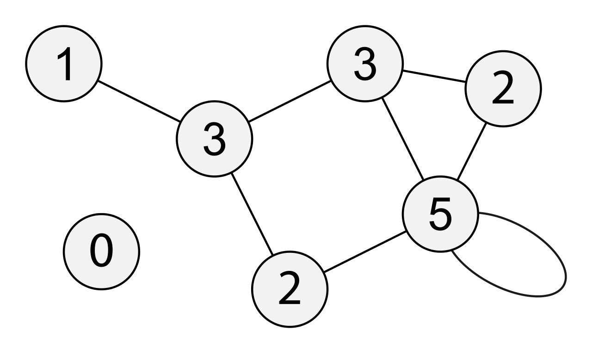
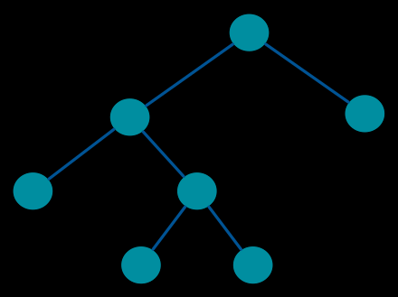
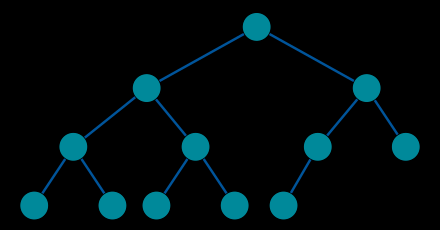
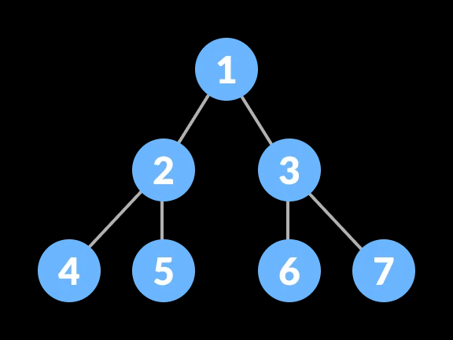
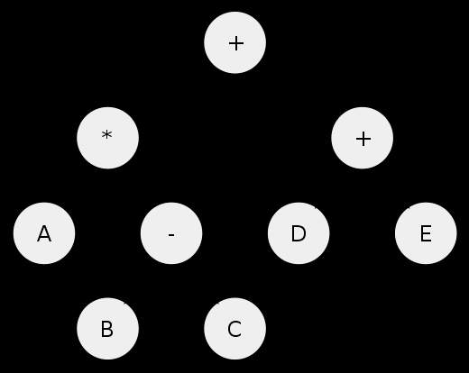
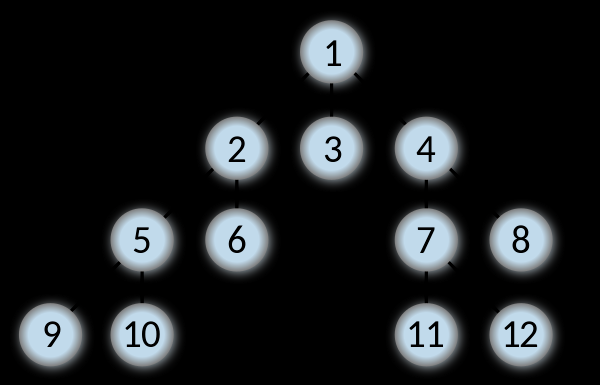
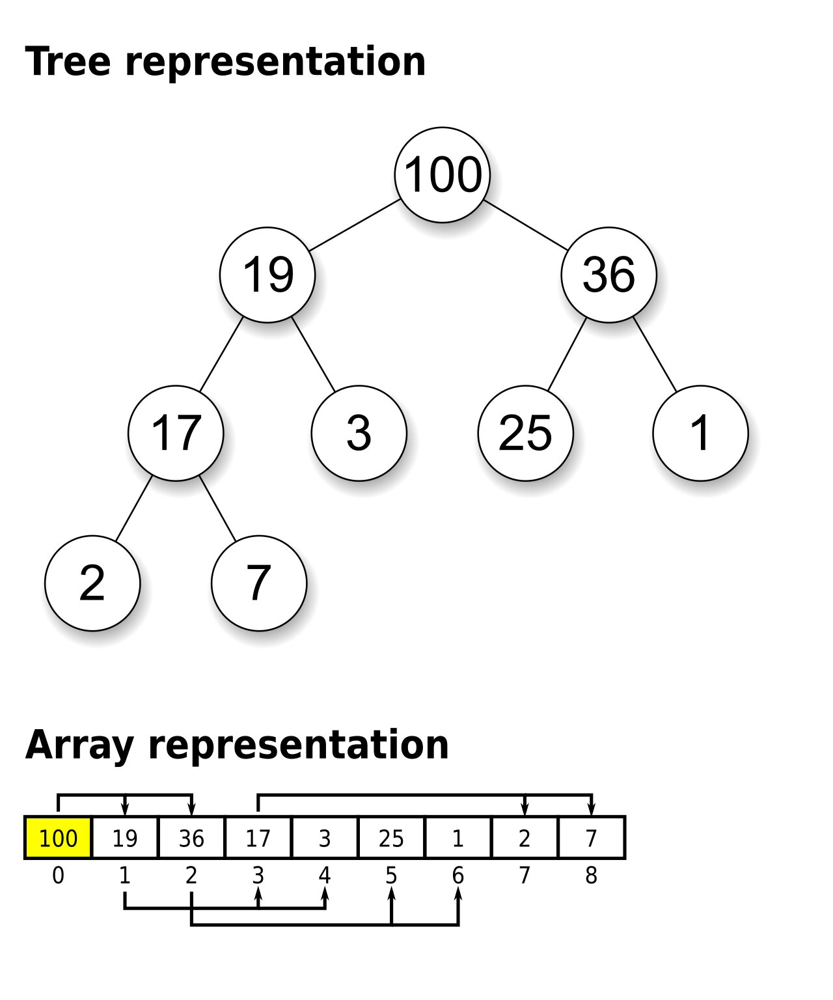
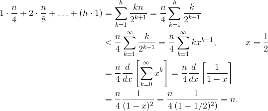

# Графы и деревья

В данной заметке я буду писать о графах и деревьях.

**Содержание:**
- [Термины теории графов](#термины-теории-графов)
- [Способы хранения графов](#способы-хранения-графов)
- [Деревья](#деревья)
- [Двоичное дерево](#двоичное-дерево)
    - [Типы двоичных деревьев](#типы-двоичных-деревьев)
    - [Свойства сбалансированных бинарных деревьев](#свойства-сбалансированных-бинарных-деревьев)
    - [Применение деревьев](#применение-деревьев)
- [Обход деревьев](#обход-деревьев)
    - [Обход в глубину](#обход-в-глубину)
        - [Рекурсивный алгоритм](#рекурсивный-алгоритм)
        - [Итеративный алгоритм](#итеративный-алгоритм)
        - [Применение DFS](#применение-dfs)
    - [Обход в ширину](#обход-в-ширину)
        - [Итеративный алгоритм](#итеративный-алгоритм-1)
        - [Применение BFS](#применение-bfs)
    - [Зачем помечать ноды](#зачем-помечать-ноды)
    - [Iterative DFS vs BFS](#iterative-dfs-vs-bfs)
    - [Tail Call Optimization](#tail-call-optimization)
- [Бинарное дерево поиска (BST)](#бинарное-дерево-поиска-bst)
    - [Основные операции на двоичном дереве поиска](#основные-операции-на-двоичном-дереве-поиска)
        - [Поиск элемента](#поиск-элемента)
        - [Вставка элемента](#вставка-элемента)
        - [Поиск преемника или наследника](#поиск-преемника-или-наследника)
    - [Обход двоичного дерева поиска](#обход-двоичного-дерева-поиска)
    - [Применение](#применение)
    - [Java Collections](#java-collections)
- [Куча (Heap)](#куча-heap)
    - [Основные операции над кучей](#основные-операции-над-кучей)
- [Бинарная куча (Binary Heap)](#бинарная-куча-binary-heap)
    - [Представление бинарной кучи](#представление-бинарной-кучи)
    - [Имплементация операций над кучей](#имплементация-операций-над-кучей)
        - [Восстановление свойства кучи - down-heapify (max-heapify, heapify)](#восстановление-свойства-кучи---down-heapify-max-heapify-heapify)
        - [Восстановление свойства кучи - up-heapify](#восстановление-свойства-кучи---up-heapify)
        - [Построение кучи за O(n)](#построение-кучи-за-on)
        - [Построение кучи за O(n \* log n). Сравнение](#построение-кучи-за-on--log-n-сравнение)
        - [Изменение значение элемента](#изменение-значение-элемента)
        - [Добавление элемента](#добавление-элемента)
        - [Извлечение максимального элемента](#извлечение-максимального-элемента)
    - [Каким именно образом в куче поддерживается свойство полного бинарного дерева](#каким-именно-образом-в-куче-поддерживается-свойство-полного-бинарного-дерева)
    - [Применение кучи](#применение-кучи)
    - [Java Collections](#java-collections-1)
    - [Пирамидальная сортировка (Heap Sort)](#пирамидальная-сортировка-heap-sort)
- [Binary Search Tree vs Binary Heap](#binary-search-tree-vs-binary-heap)
- [Implicit data structure](#implicit-data-structure)
- [Binary Tree Visualizer](#binary-tree-visualizer)
- [Самобалансирующиеся двоичные деревья поиска](#самобалансирующиеся-двоичные-деревья-поиска)
    - [Имплементации](#имплементации)
- [Red-Black Tree (Красно-Черное дерево)](#red-black-tree-красно-черное-дерево)

---

## Термины теории графов

Чтобы понять, что такое бинарные деревья, необходимо начать с графов.

Базовые понятия:

- **Граф (graph)** - это базовое понятие. Включает множество вершин и множество рёбер. Каждое ребро в графе соединяет
  две вершины.
- **Вершина (узел, Vertex, Node)** - базовое понятие. Точка, куда могут вести или выходить рёбра. Множество вершин графа
G обозначается V(G).
- **Ребро (edge)** - базовое понятие. Ребро соединяет две вершины графа
- **Дуга (directed edge)** - ориентированное ребро. Если есть две вершины (v, w), то дуга может вести только из v -> w
  или же из w -> v, то есть одна из вершин - начало дуги, а другая - конец. Однако, часто понятия ребро и дуга
  взаимозаменяются

Вес ребер:

- **Вес ребра** - значение, поставленное в соответствие данному ребру взвешенного графа. Обычно вес — вещественное
  число, в таком случае его можно интерпретировать как «длину» ребра.
- **Взвешенный граф** - граф, каждому ребру которого назначен вес ребра

Петли и циклы:

- **Петля (loop)** - ребро, начало и конец которого находятся в одной и той же вершине
- **Цикл (cycle)** - путь, который начинается и заканчивается в одной и той же вершине. Все петли являются циклами, но
  не все циклы - петли
- **Ациклический граф (acyclic graph)** - граф без циклов

Инцидентность и смежность (это об отношениях ребер и вершин):

- **Инцидентность (incidence)** - означает, что если есть вершины u1, u2 и соединяющее их ребро e, тогда вершина u1 и
  ребро e инцидентны, как и вершина u2 с ребром e. Важно, что две вершины инцидентны быть не могут - для этой цели
  используется понятие смежности
- **Смежность (adjacency)** - понятие, используемое в отношении только двух рёбер либо только двух вершин: две вершины,
  инцидентные одному ребру, также называются смежными; два ребра, инцидентные одной вершине, называются смежными
- **Степень вершины (degree)** — количество рёбер, инцидентных вершине
- **Степень захода вершины** - количество ребер, входящих в вершину
- **Степень исхода вершины** - количество ребер, исходящих из вершины

Пример графа, где у всех вершин указан degree:


Связность (это о путях):

- **Связность (connectivity, connected)** - две вершины в неориентированном графе связаны, если существует соединяющий
  их путь (англ. - nodes are connected)
- **Связный граф (connected graph)** — неориентированный граф, в котором все вершины связаны, то есть каждая нода может
  быть посещена из любой другой ноды
- **Компонента связности графа (component, connected component)** — такое максимальное подмножество вершин
  неориентированного графа (subgraph), для любых двух вершин которого существует путь из одной в другую, и не существует
  пути из вершины этого подмножества в вершину не из этого подмножества. Граф связан, если у него существует только одна
  компонента связности. Компонента связности бывает только у неориентированного графа

Путь и цикл:

- **Простой путь** — путь, все вершины которого попарно различны. Другими словами, простой путь не проходит дважды через
  одну вершину.
- **Простой цикл** — цикл, не проходящий дважды через одну вершину.
- **Расстояние между вершинами** — длина кратчайшего пути между двумя вершинами

Ориентированный граф:

- **Орграф (ориентированный граф, directed grapgh)** - граф, в котором все ребра ориентированы
- **Strongly connected graph** - ориентированный граф, в котором все вершины связаны, то есть каждая нода может быть
  посещена из любой другой ноды
- **Строгая компонента связности (strongly connected component)** - это разбиение графа на несколько subgraph, которые
  strongly connected. У directed графа несколько строгих компонент связности может быть тогда и только тогда, когда граф
  имеет циклы
- **Ориентированный ациклический граф (directed acyclic graph, DAG)** - ориентированный граф, в котором отсутствуют
  циклы. У DAG по определению существует только одна строгая компонента связности, то есть сам DAG

Другое:

- **Гамильтонов путь** — простой путь в графе, содержащий все вершины графа ровно по одному разу.
- **Гамильтонов граф** — граф, в котором есть гамильтонов цикл.
- **Эйлеров цикл** — цикл, который содержит все рёбра графа (вершины могут повторяться).
- **Эйлеров граф** — граф, в котором существует эйлеров цикл

---

## Способы хранения графов

---

## Деревья

Итак, мы выучили все базовые понятия теории графов, теперь можем перейти к деревьям.

**Дерево** — это связный неориентированный ациклический граф. Связность означает наличие маршрута между любой парой
вершин, ацикличность — отсутствие циклов. Отсюда следует, что число рёбер в дереве на единицу меньше числа вершин, а
между любыми парами вершин имеется один и только один путь

- **Ориентированное дерево** - это ориентированный ациклический граф (DAG), в котором только одна вершина имеет нулевую
  степень захода (корень), а все остальные вершины имеют степень захода 1 (в них ведёт ровно по одной дуге).
- **Корень дерева (root)** - выбранная вершина дерева. Или по-другому: вершина с нулевой степенью захода
- **Лист дерева (leaf)** - вершина дерева, из которого не исходит ни одна дуга, то есть вершина с нулевой степенью
  исхода
- **Высота дерева (height)** - наибольшая длина пути от корня к листу

Дерево как структура данных - это абстрактный тип данных, симулирующий структуру дерева - есть корень (root) и
поддеревья (subtrees). Каждый узел имеет не более одного родителя.

А вот это лес, к слову:
**Лес** — множество деревьев. Компонентами связности леса являются деревья.

## Двоичное дерево

**Двоичное (бинарное) дерево** - это:

- Ориентированное дерево, в котором исходящие степени вершин (число исходящих рёбер)
  не превосходят 2. Или же, эквивалентно:
- Структура данных, в которой каждый узел имеет не более двух детей. Как правило, сам узел называется родительским
  узлом, а дети называются левым и правым наследниками.

### Типы двоичных деревьев

**Full binary tree** - это двоичное дерево, где у каждого узла либо 0, либо 2 ребенка. То есть у всех нод кроме листьев
есть 2 ребенка.



**Complete binary tree** - это двоичное дерево, где все уровни дерева максимально заполнены, кроме, возможно,
последнего. Если последний уровень не полный, то уровень заполнен слева направо, причем листья стремятся к левой
стороне. Из этого следует, что глубина листьев отличается не более чем на один уровень



**Perfect binary tree** - это двоичное дерево, где у каждого узла есть ровно 2 ребенка и все листья находятся на
одинаковом уровне. То есть, все уровни дерева заполнены максимально, включая последний.



**Сбалансированное дерево (balanced tree)** - это дерево, которое имеет минимально возможное количество уровней.
Очевидно, что это возможно, только если каждый уровень будет заполнен максимально.

Complete или perfect binary tree всегда являются сбалансированным деревом по определению, но не верно обратное, так как
сбалансированным может быть и full binary tree.

Сводка:

- Perfect: должно быть balanced; должно быть full
- Complete: должно быть balanced; может быть full
- Full: может быть balanced; может быть complete

### Свойства сбалансированных бинарных деревьев

1. Если считать что root - это 0 уровень, то на каждом уровне i, находится ровно 2^i элементов. На последнем же уровне k
   может быть от 1 до 2^k элементов
2. Высота сбалансированного дерева - это log2(n), где n - количество элементов в дереве

Почему это так? Смотри, исходя из первого утверждения, можно посчитать сумму узлов
так: `n = 2^0 + 2^1 + ... + 2^(h - 1)`, где h - количество уровней в дереве. Мы видим, что это геометрическая
прогрессия, и всю эту сумму можно представить как `n = 2^h - 1 <=> 2^h = n + 1`. Отсюда можно
вычислить `h = log2(n + 1)`. Так как нам нужно целое число, то можно или округлить n до ближайшей степени 2 в большую
сторону или же просто взять ceiling от результата, что на машине вычислить проще.

Запомни это - логарифм будет часто встречаться при асимптотической оценке времени работы операций и связан именно с
высотой дерева.

Однако, в таких сбалансированных деревьях, как Red-Black Tree или AVL Tree, доказательство будет несколько иным и его
нужно изучать отдельно. Здесь я говорил только про бинарные perfect/complete деревья.

### Применение деревьев

1. Дерево используется в качестве Abstract Syntax Tree

    

    Тогда для AST:

    - Pre-order обход позволяет сделать префиксную нотацию (Polish notation) - `+ 3 4`
    - Post-order обход позволяет сделать постфиксную нотацию (Reverse Polish notation) - `3 4 +`. Такое выражение легко
      превращается в машинный код, чтобы далее выполнить этот код стек машиной

2. Дерево используется как структура данных: BST, Heap
3. Устройство файловых систем

---

## Обход деревьев

Обход дерева - это алгоритм посещения всех узлов в дереве по ровно одному разу. Данные алгоритмы классифицируются по
порядку обхода нод. Обход дерева бывает в глубину и ширину. Алгоритмы называются соответственно *DFS (depth-first
search)* и *BFS(breadth-first search)*.

Почему вообще нужны эти алгоритмы обхода? Дело в том, что деревья сильно отличаются по устройству от таких линейных
структур данных как массивы и списки, которые обычно обходятся все линейном порядке. Но так как дерево не имеет четкого
порядка элементов, то есть каждая нода имеет несколько нод, куда можно пойти дальше, а не линейный порядок, то для этого
нам и нужны специальные алгоритмы обхода.

При обходе нам необходимо хранить отложенные на каждом уровне дерева ноды для их дальнейшего посещения. Для этих целей
используют стек (stack) или очередь (queue). Однако, так как дерево - это self-referential (recursively defined)
data structure, то обход можно сделать с помощью рекурсии или даже корекурсии. В случае рекурсии мы храним отложенные
ноды в call stack, а в случае корекурсии мы вообще не заполняем стек.

### Обход в глубину

При обходе в глубину мы продвигаемся как можно глубже по дереву, прежде чем идти к следующему соседу. Для обхода в
глубину возможна как рекурсивная, так и итеративная имплементация. Конечно, лучше применять итеративную в тех языках, где нет tail call optimization или корекурсии.

Анимация работы алгоритма:


Существует несколько видов обхода в глубину в зависимости от порядка обхода нод:

1. *Preorder* - посещает текущую вершину *перед* посещением ее детей
2. *Postorder* - посещает текущую вершину *после* посещения ее детей
3. *Inorder* - посещает сначала левых детей, затем текущую ноду, и затем правых детей. Этот способ обхода применим только в двоичном дереве

Например, возьмем для примера бинарное дерево, тогда обходы могут быть такими:
- Preorder - Root, Left, Right
- Postorder - Left, Right, Root
- Inorder - Left, Root, Right

#### Рекурсивный алгоритм

В рекурсивном алгоритме мы используем стек для хранения нод неявно - через call stack.

**Псевдокод:**

```text
procedure DFS(G, v) is
    label v as discovered
    if preorder: do v
    for all directed edges from v to w that are in G.adjacentEdges(v) do
        if vertex w is not labeled as discovered then
            recursively call DFS(G, w)
    if postorder: do v
```

Здесь, в зависимости от требуемого порядка обхода, мы можем сделать нужное действие с текущей нодой перед посещением детей (preorder) или после (postorder).

Если мы имеем двоичное дерево, а не произвольный граф, то обходить конечно становится проще. Обычно больше не нужно хранить список смежности для поиска смежных нод. Все ноды хранятся как ссылки в текущей ноде. Поэтому для двоичного дерева получается так:

```text
procedure DFS(G, v) is
    label v as discovered
    if preorder: do v
    if vertex v.left is not labeled as discovered then
        recursively call DFS(G, v.left)
    if inorder: do v
    if vertex v.right is not labeled as discovered then
        recursively call DFS(G, v.right)
    if postorder: do v
```

#### Итеративный алгоритм

В итеративном алгоритме необходимо создать стек явно.

**Псевдокод:**

```text
procedure DFS(G, root) is
    let S be a stack
    label root as discovered
    S.push(root)
    while S is not empty do
        v := Q.pop()
        for all edges from v to w in G.adjacentEdges(v) do
            if w is not labeled as discovered then
                S.push(w)
```

#### Применение DFS

- Топологическая сортировка
- Нахождение компонент сильной связности
- Поиск цикла

---

### Обход в ширину

Обход в ширину сначала обходит все ноды на текущем уровне дерева слева направо, прежде чем углубляться на нижний
уровень. Вот порядок, в котором будет обойдено дерево:



Анимация, показывающая работу алгоритма BFS (черные - посещенные, серые - поставленные в очередь):


Обход в ширину обычно имплементируется как non-recursive алгоритм, где используется очередь (FIFO), а также проверяется,
не был ли посещен текущий узел, прежде чем класть его в очередь.

Принцип работы заключается в том, что при взятии очередной ноды из очереди мы достаем ее детей, помечаем их как посещенные и кладем в очередь.
Так как очередь работает по принципу FIFO, то при взятии очередного элемента из очереди мы берем
самый ранний встретившийся элемент, то есть встретившийся на как можно более высоком уровне. Это означает, что мы не
уйдем с текущего уровня дерева, пока не обойдем все элементы на нем.

#### Итеративный алгоритм

**Псевдокод:**

```text
procedure BFS(G, root) is
    let Q be a queue
    label root as explored
    Q.enqueue(root)
    while Q is not empty do
        v := Q.dequeue()
        for all edges from v to w in G.adjacentEdges(v) do
            if w is not labeled as explored then
                label w as explored
                Q.enqueue(w)
```

#### Применение BFS

- Нахождение наикратчайшего пути между двумя нодами
- Нахождение компонент связности

---

### Зачем помечать ноды

В DFS/BFS мы заводим такие массивы: `visited[], marked[]`, которые служат для того, чтобы помечать ноды как посещенные.
Но зачем же нам нужно делать это?

Помечать ноды как посещенные нам нужно по нескольким причинам:

1. Чтобы не обойти узел по несколько раз в орграфе, который может содержать циклы и петли
2. Чтобы обойти все компоненты связности в графе. Если не помечать ноды как посещенные при обходе, то мы не сможем
   понять, какую компоненту уже обошли, а какую нет
3. Чтобы не обойти узел по несколько раз в неориентированном графе

Однако, если мы заранее гарантированно знаем, что мы обходим DAG или дерево, которое является dag, то помечать
элементы не нужно, так как DAG по определению ориентирован, не содержит циклов и содержит только одну компоненту
связности.

---

### Iterative DFS vs BFS

Вы могли заметить, что итеративные имплементации DFS и BFS очень похожи.

Единственные их отличия это:
1. Разная структура данных для хранения нод: Stack vs Queue
2. Порядок помечания ноды как посещенной: в BFS помечаем перед добавлением, а в DFS - после взятия ноды

Если бы нам не нужно было посещать ноды как посещенные, то мы бы могли вообще унифицировать алгоритм:

```text
procedure traversal(G, root, collection) is
    collection.add(root)
    while collection is not empty do
        v := collection.remove()
        for all edges from v to w in G.adjacentEdges(v) do
            collection.add(w)
```

Это я пишу, чтобы эта мысль стала более понятной: обход DFS и BFS отличается порядком обхода нод - по сути это LIFO (углубляемся вниз по дереву) vs FIFO (не уходим с уровня пока не посетим все).

---

### Tail Call Optimization

Многие операции на деревьях могут быть имплементированы как рекурсивно, так и итеративно. И рекурсивно не всегда плохо,
так как существует такая вещь как Tail Call Optimization, которая происходит на уровне компиляции.

**Tail Call Optimization (TCO или Tail Call Elimination, TCE)** - это когда машина может сделать вызов функции без
выделения памяти на call stack. Единственная ситуация, когда происходит эта
оптимизация, это когда *последняя инструкция* в функции f - вызов другой функции g или же самой функции f, что называется
tail call, от чего и произошло имя оптимизации. Эта оптимизация возможна потому, что мы не делаем других действий после вызова другой функции и не обрабатываем ее результат. Соответственно, хранить данные о текущей функции в Call Stack не имеет смысла, так как ее выполнение завершилось полностью.

Tail Call Optimization особенно полезна при написании рекурсивных методов, так как они могут разрастаться по стеку
довольно далеко.

Вот такую функцию оптимизировать нельзя, так как в call stack нужно сохранить текущее значение n, чтобы позднее умножить
его на рекурсивный вызов:

```text
def fact(n):
    if n == 0:
        return 1
    return n * fact(n - 1)
```

А вот эту функцию `fact_h` оптимизировать можно, так как никакой обработки результата рекурсивного вызова не требуется:

```text
def fact_h(n, acc):
    if n == 0:
        return acc
    return fact_h(n - 1, acc * n)

def fact(n):
    return fact_h(n, 1)
```

**К сожалению, в Java нет TCO**. Такая оптимизация в основном есть в функциональных языках, а не императивных, например
Haskell, Scala.

---

## Бинарное дерево поиска (BST)

**Бинарное дерево поиска (Binary Search Tree, BST)** - бинарное дерево, для которого выполняются следующие условия:
1. Оба поддерева — левое и правое — являются двоичными деревьями поиска
2. У всех узлов левого поддерева произвольной вершины X значения ключей данных меньше, чем значение ключа данных самого
   узла X
3. У всех узлов правого поддерева произвольной вершины X значения ключей данных больше либо равны, чем значение ключа
   данных самого узла X

Очевидно, данные в каждом узле должны обладать ключами, на которых определена операция сравнения меньше.

Двоичное дерево поиска - это структура данных, которая может выступать в качестве имплементации некоторых АТД.
Двоичное дерево поиска не следует путать с двоичной кучей, построенной по другим правилам. Ее мы рассмотрим позже.

Вот так выглядит двоичное дерево поиска:


Сложность выполнения операций:

|       | В среднем | В худшем |
|---------------|:---------:|:--------:|
| Расход памяти |   O(n)    |   O(n)   |
| Поиск         | O(log n)  |   O(n)   |
| Вставка       | O(log n)  |   O(n)   |
| Удаление      | O(log n) |   O(n)   |

### Основные операции на двоичном дереве поиска

Базовый интерфейс двоичного дерева поиска состоит из трёх операций:

1. Поиск элемента — поиск узла по ключу
2. Вставка элемента — добавление в дерево нового значения
3. Удаление элемента — удаление узла по ключу

#### Поиск элемента

Рекурсивная имплементация поиска довольно проста:

1. Если искомый элемент меньше текущего, то идем рекурсивно искать в левое поддерево
2. Иначе идем рекурсивно искать в правое поддерево

#### Вставка элемента

Мы вставляем новый элемент путем добавления листа.

Мы опускаемся по дереву вниз, на каждом шаге проверяя, куда пойти: если вставляемый элемент меньше чем текущий, то идем
в левое поддерево, иначе идем в правое. Если указатель на левое или правое поддерево = null, значит мы дошли до
родителя, к которому и нужно присоединить лист.

#### Поиск преемника или наследника

**Наследник (successor)** - это наименьший больший элемент, чем указанный.

Поиск наследника указанной ноды X работает так:

1. Если для ноды X существует правое поддерево, то возвращаем минимум из этого поддерева
2. Иначе смотри. Мы знаем, что если нода X - левая нода родителя, то родитель больше нас, если же мы - правая нода
   родителя, то родитель меньше нас. Так как нам нужно найти больший элемент, чем указанный, это означает, что нам нужно
   найти такого ближайшего родителя, для которого нода X будет лежать в его левом поддереве

**Преемник (predecessor)** - это наибольший меньший элемент, чем указанный.

Поиск преемника указанной ноды X работает так по аналогии:

1. Если для ноды X существует левое поддерево, то возвращаем максимум из этого поддерева
2. Иначе нам нужно найти такого ближайшего родителя, для которого нода X будет лежать в его правом поддереве

Эти методы нам требуются как для выполнения их прямых задач - нахождения successor/predecessor элемента, так и для
имплементации обхода элементов через iterator.

### Обход двоичного дерева поиска

In-order dfs обход двоичного дерева поиска позволяет обойти элементы дерева в неубывающем порядке ключей, что можно
использовать для сортировки.

Однако, обход в Java в TreeMap сделан через iterator, который использует метод successor() для нахождения следующего
элемента и обхода элементов в отсортированном (возрастающем) порядке.

Какова же сложность обхода дерева через iterator? Для этого нужно разобраться с временем работы successor/predecessor.
Понятно, что в худшем случае эти операции могут занять время O(log n). Однако, интуитивно понятно, что в
сбалансированном BST на самом деле в среднем случае эти операции занимают константное время O(1), так как большинство
элементов находятся именно на нижних уровнях дерева и нам не придется сделать много щагов, углубляясь вниз или
поднимаясь наверх.

Итак, тогда обход дерева через iterator - это время O(n).

### Применение

Основным преимуществом двоичного дерева поиска перед другими структурами данных является возможная высокая эффективность
основанных на нём алгоритмов поиска и сортировки.

BST позволяют сделать операции поиска, добавления и удаления данных за время за O(log n). BST может использоваться для:

1. Имплементация таких абстрактных типов данных как сет, мультисет и словарь
2. Сортировка Tree Sort, которая основана на BST
3. Поиск элементов

Время log n исходит из того, что для поиска, добавления или удаления элементов мы на каждой итерации снижаемся ниже по
дереву, что в среднем случае занимает ровно столько шагов, сколько уровней в дереве. Так как дерево не сбалансированное,
то bst может деградировать в односвязный список, что в худшем случае приводит к времени O(n).

По сути, поиск в двоичном дереве поиска - это binary search.

### Java Collections

- В Java BST представлено в
  виде [TreeMap](https://docs.oracle.com/en/java/javase/11/docs/api/java.base/java/util/TreeMap.html), где используется
  Red-Black Tree

---

## Куча (Heap)

**Куча (Heap)** - это структура данных типа дерево, которая удовлетворяет *свойству кучи*: если B является ребенком узла A, то ключ(A) >= ключ (B). То есть, значение в любой вершине не меньше, чем значения ее детей.

Из этого свойства кучи следует, что элемент с наибольшим ключом всегда является корнем кучи, поэтому такие кучи также называются max-кучами. Однако, можно сравнение в свойстве перевернуть, и тогда в корневом узле будет лежать наименьший элемент (min-куча).

Не существует никаких ограничений относительно того, сколько потомков имеет каждый узел кучи. Кучи бывают самые разные:
- Двоичная куча (Binary heap)
- Фибоначчиева куча (Fibonacci heap)
- Биномиальная куча (Binomial heap)
- и много других

Далее мы рассмотрим только самый популярный и применяющийся на практике вид кучи - двоичная куча.

### Основные операции над кучей

- Найти максимум (минимум): найти максимальный элемент в max-куче (min-куче)
- Извлечь максимум (минимум): извлечь корневой узел
- Увеличить или уменьшить ключ: обновить ключ в некотором узле с поддержанием свойства кучи
- Добавить: добавление нового элемента в кучу с поддержанием свойства кучи

---

## Бинарная куча (Binary Heap)

**Бинарная куча (пирамида, Binary Heap)** - это структура данных типа куча, для которой выполняется 2 условия:

- **Свойство кучи:** ключ в каждом узле больше или равен, чем любой из детей - max-heap. Однако, сравнение может быть и обратным - min-heap
- **Свойство формы:** бинарная куча - это полное или почти полное бинарное дерево (complete binary tree), то есть все уровни
  дерева заполнены, кроме, возможно, последнего. Если последний уровень не полный, то уровень заполнен слева направо,
  причем все листья стремятся к левой стороне. Из этого следует, что глубина листьев отличается не более чем на один
  уровень

Далее мы будем говорить только о max-кучах для удобства.

Вот как выглядит max куча:



Сложность выполнения операций:

|                | В среднем | В худшем |
|----------------|:---------:|:--------:|
| Расход памяти  |   O(n)    |   O(n)   |
| Поиск          |   O(n)    |   O(n)   |
| Вставка        |   O(1)    | O(log n) |
| Поиск max      |   O(1)    |   O(1)   |
| Извлечение max | O(log n)  | O(log n) |

### Представление бинарной кучи

Полная бинарная куча может быть представлена очень эффективным способом с помощью массива. Первый элемент будет содержать корень. Следующие два элемента массива содержат ребенков корня. Следующие четыре элемента содержат ребенков этих ребенков и так далее. Таким образом, ребенка узла i будут расположены на позициях 2i и 2i+1 для массива, индексируемого с единицы, или на позициях 2i+1 и 2i+2 для массива, индексируемого с нуля. Это позволяет перемещаться вверх или вниз по дереву, на лету вычисляя индекс нужной ячейки массива, что исключает наличие указателей между её элементами.

### Имплементация операций над кучей

#### Восстановление свойства кучи - down-heapify (max-heapify, heapify)

Если ключ в ноде *уменьшается*, то может нарушиться свойство кучи, так как элемент может перестать быть больше детей.

*Up-heapify* - это процедура для восстановления свойства кучи путем опускания слишком маленького элемента вниз.

DownHeapify подразумевает, что левое и правое поддеревья удовлетворяют условию упорядоченности, и нам нужно исправить
только переданную ноду. Эта процедура принимает на вход массив элементов A и индекс i. Она восстанавливает свойство
упорядоченности во всём поддереве, корнем которого является элемент A.

Если i-й элемент больше, чем его сыновья, то всё поддерево уже является кучей, и делать ничего не надо. В противном
случае меняем местами i-й элемент с наибольшим из его сыновей, после чего выполняем downHeapify повторно для этого
элемента. Наибольшего из сыновей нужно брать, чтобы после свопа родителя и ребенка этот ключ был как больше родителя,
так и другого ребенка.

Выполнять повторно downHeapify нужно потому, что после свопа элемент может все еще быть меньше чем его новые ребенки, и
его нужно опускать вниз до тех пор, пока не будет выполнено свойство кучи.

Процедура выполняется за время O(log n).

Heapify - это всегда опускание элемента вниз. Поэтому heapify иногда зовется down-heapify, sink-down, bubble-down.

#### Восстановление свойства кучи - up-heapify

Если ключ в ноде *увеличивается*, то может нарушиться свойство кучи, так как элемент может перестать быть меньше
родителя.

*Up-heapify* - это процедура для восстановления свойства кучи путем поднятия слишком большого элемента наверх.

Если элемент меньше своего родителя, условие соблюдено для всего дерева, и больше ничего делать не нужно. Если он
больше, мы меняем его местами с родителем. Мы повторяем это действие до тех пор, пока не восстановим свойство кучи. То
есть, в итоге этой операции слишком большой элемент всплывает наверх.

Также эта процедура называется sink up, bubble up (всплытие).

Процедура up-heapify нужна нам для процедуры добавления нового элемента в кучу.

Процедура выполняется чаще всего за константное время O(1), так как добавлять элементы снизу на практике выходит
быстрее, чем сверху, так как количество элементов растет экспоненциально с ростом высоты дерева, и намного больше
вероятность, что мы найдем нужное место среди нижних уровней, чем верхних. Однако, в худшем случае процедура может
отработать и за O(log n), если придется поднимать элемент до корня.

#### Построение кучи за O(n)

Эта процедура предназначена для создания кучи из неупорядоченного массива входных данных за время O(n).

Заметим, что если выполнить downHeapify для всех элементов массива A, начиная с последнего и кончая первым, он станет
кучей. В самом деле, легко доказать по индукции, что к моменту выполнения downHeapify(A, i) все поддеревья, чьи корни
имеют индекс больше i, являются кучами, и, следовательно, после выполнения downHeapify(A, i) кучей будут все поддеревья,
чьи корни имеют индекс, не меньший i.

Можно заметить, что downHeapify(A,i) не делает ничего, если i>N/2 (при нумерации с первого элемента), где N — количество
элементов массива. В самом деле, у таких элементов нет детей и мы не сможем сравнить ключ ни с чем. то есть вызов
heapify не будет иметь эффекта. Следовательно, соответствующие поддеревья уже являются кучами, так как содержат всего
один элемент.

То есть, вся фишка работы данной процедуры в том, что когда мы передаем очередной элемент в downHeapify, мы знаем, что
его дети уже являются кучами, так как мы прошли их ранее.

Таким образом, достаточно вызвать downHeapify для всех элементов массива A, начиная с (N/2)-го и кончая нулевым.

Может показаться, что время работы этого алгоритма - `O((n/2) * log n) = O(n * log n)`, но это не так. На самом деле
этот алгоритм работает за O(n).

Хотя upHeapify и downHeapify имеют одинаковое время O(log n) в худшем случае, заметим вот что:

1. Большинство элементов дерева сосредоточены на нижних уровнях: наверху дерева находится только один элемент, а
   половина всех нод лежит вообще на последнем уровне
2. Если последний уровень - это h (все элементы с индексом > n / 2), то при вызове downHeapify для всех элементов на
   уровне h - 1 каждый из элементов может опуститься максимум на 1 уровень. Для всех элементов на уровне h - 2 элемент
   может опуститься максимум на 2 уровня. И если обобщить: на уровне i элемент может опуститься максимум на h - i
   уровней вниз.

Несложно догадаться, что операции downHeapify занимают намного меньшее время, чем log n, почти что константное. Поэтому
интуитивно понятно, что время построения кучи в действительности - это `O(n)`.

Это можно доказать формально через бесконечную сумму и ряд Тейлора, и вот оно под катом:

<details>
    <summary>Доказательство</summary>


</details>

#### Построение кучи за O(n * log n). Сравнение

Также можно построить кучу, используя up-heapify. Тогда нам нужно начать с начала массива и вызывать на каждом элементе
up-heapify. Когда мы берем очередной элемент i, мы знаем что все элементы с индексом < i уже являются кучей.

Такой вариант займет время O(n * log n), потому что чем дальше мы идем по массиву, тем больше уровней в дереве у нас
появляется, тем большее время up-heapify будет занимать, особенно на последнем уровне.

Итак, смотри, вот какую работу нужно проделать для решения на основе downHeapify:

```(0 *n/2) + (1* n/4) + (2 *n/8) + ... + (h* 1)```

Каждый член в сумме имеет максимальную дистанцию, которую ноде придется пройти (0 для нижнего уровня с индексом i > n/2,
и ровно h для корня), умноженную на количество нод на данном уровне.

А вот такую работу нужно проделать для решения на основе up-heapify:

```(h *n/2) + ((h-1)* n/4) + ((h-2)*n/8) + ... + (0* 1)```

Мы видим, что здесь основная работа происходит именно на нижних уровнях, где сосредоточено наибольшее количество
элементов. Сравни: здесь n/2 элементов на нижнем уровне h могут пройти дистанцию h, а а первом - 0.

Из анализа становится очевидно, что решение на основе downHeapify работает намного быстрее.

#### Изменение значение элемента

Процедура заменяет элемент кучи на новый ключ с любым значением. Временная сложность O(log n).

Вот как мы опускаем значение:

1. Изменяем значение в ноде на новое, меньшее или равное чем исходное
2. Вызываем down-heapify на нем

А вот как мы поднимаем значение:

1. Изменяем значение в ноде на новое, большее или равное чем исходное
2. Вызываем up-heapify на нем

#### Добавление элемента

Добавляет новый элемент в кучу за время O(log n).

Имплементация:

1. Добавление элемента в конец кучи
2. Вызов up-heapify на этом элементе

Сложность - O(log n).

#### Извлечение максимального элемента

Выполняет извлечение максимального элемента из кучи за время O(log n).

Извлечение выполняется в четыре этапа:

1. В переменную сохраняется значение корневого элемента (который и является максимальным)
2. Самый последний элемент перемещается в корень
3. Вызывается maxHeapify для нового корня, чтобы восстановить свойство кучи
4. Возвращается максимальный элемент из сохраненной переменной

### Каким именно образом в куче поддерживается свойство полного бинарного дерева

Почему же куча всегда является полным бинарным деревом?

Все дело в том, что когда мы добавляем новый элемент в кучу, он всегда ставится на следующее место на последнем уровне
дерева. Даже когда мы вызовем siftUp, элемент поднимется вверх только по тому поддереву, в которое мы вставили элемент,
а на его место встанет какой-нибудь другой элемент из этого поддерева. То есть мы никогда не выходим за рамки последнего
уровня при добавлении нового элемента. Таким образом, мы всегда сначала заполняем последний уровень, прежде чем начинать
следующий, и поэтому куча является полным бинарным деревом.

### Применение кучи

- Куча используется как эффективная имплементация АТД "Очередь с приоритетом"
- Пирамидальная сортировка, которая использует внутри себя кучу
- Алгоритмы поиска: при использовании кучи поиск минимума, максимума, медианы или k-го наибольшего элемента может быть
  сделан за линейное время (часто даже за константное время)

### Java Collections

- В Java структура данных "Очередь с приоритетом" построена на основе бинарной кучи - [PriorityQueue](https://docs.oracle.com/en/java/javase/11/docs/api/java.base/java/util/PriorityQueue.html)

### Пирамидальная сортировка (Heap Sort)

Здесь же опишу пирамидальную сортировку, которая выполняется за время O(n * log n) на месте (без привлечения
дополнительной памяти).

Идея работы алгоритма. Мы знаем, что первый элемент кучи - это корень, где всегда лежит максимальный элемент. Если
обменять корень с последним элементом, то в конце массива будет лежать максимальный элемент из кучи. Если после этого
исключить последний элемент из кучи, то есть уменьшить размер кучи на 1, то первые N-1 элементов кучи будут
удовлетворять свойству кучи, кроме, возможно, корня. Но мы можем вызвать heapify на корне и снова восстановить свойство
кучи, после чего в корне будет лежать наибольшее значение из всех оставшихся элементов кучи. Мы снова обмениваем корень
с последним элементом и повторяем те же самые действия. В итоге, когда после множества повторений элементов в куче
больше не останется, мы получим отсортированный массив.

---

## Binary Search Tree vs Binary Heap

Так когда же использовать BST, а когда Binary Heap? Давай разберемся.

Чем они похожи:

- Они оба - двоичные деревья. ВСЕ.

Чем они различаются:

- BST - это структура данных с определенным порядком элементом, то есть мы можем пройтись по ней в возрастающем или
  убывающем порядке. В куче же нет определенного порядка элементов
- BST может быть как сбалансированным, так и несбалансированным, ведь оно может выродиться в односвязный список. Heap -
  это полное бинарное дерево, которое по определению не может быть несбалансированным
- Временем работы операций

Поговорим подробнее про время работы операций:

*Поиск:*

- В BST поиск произвольного ключа в среднем случае выполняется за O(log n), так как в нем по сути работает бинарный
  поиск. Однако при деградации в односвязный список поиск может занять время O(n)
- В Heap поиск произвольного ключа выполняется за O(n), однако поиск max элемента работает за O(1) во всех случаях

*Вставка:*

- В BST вставка в среднем случае выполняется за O(log n), в худшем случае за O(n)
- В Heap вставка в среднем случае выполняется за O(1), в худшем случае за O(log n)

Почему же вставка в Heap выполняется в среднем за O(1)? Вот интуитивные аргументы:

- нижние элементы имеют экспоненциально большее число элементов, чем верхние, поэтому наверняка новые элементы пойдут
  ближе к нижнему уровню
- вставка в кучу происходит с низа дерева, а в BST - сверху. Принимая во внимание первый пункт, понятно, что в BST
  придется сделать больше шагов, чтобы найти место для вставки

Даже более скажу, довести на практике в куче вставку до времени O(log n) практически нереально. Это будет почти всегда
гарантированно константное время (здесь есть тест - <https://stackoverflow.com/a/29548834/8521177>).

*Удаление:*

- в BST удаление в среднем выполняется за O(log n), но в худшем случае может занять O(n)
- В Heap удаление max элемента выполняется за O(log n) во всех случаях

**Таким образом, мы видим, что Binary Heap особенно хорошо подходит:**

- Когда нужно добиться эффективного константного времени вставки элементов
- Когда нужно эффективно работать с минимальным/максимальным элементом
- Когда хочется использовать как можно меньше памяти, т.к. куча может быть представлена в виде массива

**BST подходит:**

- Когда нужен быстрый поиск произвольного элемента
- Когда нужно быстро взять successor или predecessor по указанному ключу
- Когда нужно поддержать отсортированный порядок элементов и обходить элементы в убывающем/возрастающем порядке

Часто говорят, что именно куча позволяет эффективно работать с максимальным элементом. Однако, давайте подумаем, почему так? Ведь что мешает нам просто поддерживать указатель на максимальный элемент в BST? Тогда мы смогли бы и находить его за O(1), и удалять его за O(log n).
Однако, для работы с максимальным элементом следует использовать Heap по следующим причинам:
- Более эффективное представление в памяти
- Удаление наименьшего/наибольшего элемента при извлечении даже в худшем случае займет O(log n) в отличии от BST, где
  оно может занять O(n)
- BST имеет больше накладных расходов, чем куча: например, нужно поддерживать отсортированный порядок элементов

---

## Implicit data structure

**Implicit data structure (space-efficient data structure)** - это структура данных, которая содержит малое количество дополнительной информации кроме как самих основных данных, то есть такая структура данных имеет очень низкий overhead.

Эти структуры данных называются implicit, потому что позиция элементов имеет смысл, и исходя из их позиции можно узнать отношение между элементами.

Так, бинарное дерева поиска обычно представляется в виде нод и указателей на ноды, что несет за собой накладные расходы на память, а куча же использует массив для хранения данных, где позиция элементов вычисляется на лету.

---

## Binary Tree Visualizer

Сайт, где можно поиграться с двоичными деревьями - [http://btv.melezinek.cz/](http://btv.melezinek.cz/)

---

## Самобалансирующиеся двоичные деревья поиска

**Самобалансирующиеся двоичные деревья поиска (Self-balancing binary search tree)** - это такие деревья поиска, которые гарантируют логарифмический рост высоты дерева в зависимости от количества элементов. То есть, уровень поддеревьев всегда различается не более чем на 1, при чем это свойство поддерживается постоянно в независимости от количества элементов и порядка добавления элементов.

Сбалансированные деревья дают такое же время выполнения операций в среднем случае, как и обычная имплементация BST, но все дело в худшем случае. Так как дерево постоянно остается сбалансированным, то деградации в односвязный список никогда не будет, и поэтому такие операции как поиск, вставка и удаление будут *всегда* работать за O(log n).

### Имплементации

Самые популярные и применяющиеся на практике виды сбалансированных BST - это Red-Black Tree (RB Tree) и AVL Tree.

## Red-Black Tree (Красно-Черное дерево)

<https://www.baeldung.com/cs/red-black-trees>
