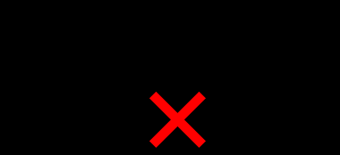

# Связный список

**Содержание:**
- [Описание](#описание)
- [Идея](#идея)
- [Односвязные и двусвязные списки](#односвязные-и-двусвязные-списки)
- [Имплементация](#имплементация)
    - [Имплементация двусвязного списка](#имплементация-двусвязного-списка)
- [Сравнение: Связный список vs Массив](#сравнение-связный-список-vs-массив)
    - [Преимущества](#преимущества)
    - [Недостатки](#недостатки)

---

## Описание

**Связный список** - это коллекция элементов, порядок которых не зависит от положения в памяти. Каждый элемент списка имеет указатель на следующий элемент.

Связные списки наравне с массивами являются базовыми структурами данными, которые позволяют имплементировать более сложные структуры данных.

## Идея

Элементы связного списка называются *нодами*. Идея связного списка заключается в том, чтобы хранить данные в нодах, а каждая нода указывает на следующую. Указатель на следующий элемент называется next pointer. Первый элемент списка называется головой (head), а последний элемент списка - хвостом. Мы знаем, что элемент последний, если этот элемент содержит null в качестве указателя на следующую ноду.

## Односвязные и двусвязные списки

Выше мы обсуждали *односвязные списки*: в элементах такого списка имеется только одна связь - на следующий элемент. Однако, мы также можем хранить указатель на предыдущий элемент (previous pointer) - такой список называется *двусвязным*.

Двусвязный список позволяет нам дополнительно:
- Итерироваться по списку в обратном порядке, так как мы имеем указатель на предыдущий элемент
- Эффективно производить удаление ноды, зная только ее адрес. Чтобы сделать то же самое в односвязном списке, нам пришлось бы итерироваться с начала списка для нахождения предыдущего элемента, что из константного времени превращается в O(n). В том числе это помогает производить удаление последнего элемента списка

---

## Имплементация

Итак, для односвязного списка мы определим следующие операции:
- Вставка элемента в начало списка
- Вставка элемента в конец списка
- Вставка элемента после определенной ноды
- Удаление элемента с начала списка
- Удаление элемента после определенной ноды

Такие операции, как вставка и удаление элемента перед указанной нодой, удаление указанной ноды или же удаление последнего элемента списка не имеют смысла для односвязного списка, так как для их имплементации потребуется итерироваться по элементам списка для нахождения предыдущего элемента, что выливается в временную сложность O(n). Да, они возможны, но список тем и хорош, что позволяет динамически добавлять и удалять элементы за константное время при знании места вставки или удаления.

Определим структуру ноды:

```java
    public static class Node<E> {
        E data;
        Node<E> next;

        Node(E data) {
            this.data = Objects.requireNonNull(data, Data must not be null!);
            next = null;
        }

        @Override
        public String toString() {
            return "Node{" +
                "data=" + data +
                '}';
        }
    }
```

Создадим класс для односвязного списка: мы будем хранить голову и хвост списка, которые указывают на самый первый и последний элемент списка соответственно.

```java
public class SinglyLinkedList<E> {

    private Node<E> head; // голова списка
    private Node<E> tail; // хвост списка
    private int size; // количество элементов в списке

    public SinglyLinkedList() {
        head = tail = null;
    }
}
```

Имплементируем вставку в начало списка:

```java
    public Node<E> insertFirst(E e) {
        Node<E> newNode = new Node<>(e);
        Node<E> head = this.head;
        if (head != null) {
            newNode.next = head;
            this.head = newNode; // смещаем голову списка
        } else {
            this.head = this.tail = newNode; // пустой список
        }
        ++size;
        return newNode;
    }
```

Вставка после определенного элемента выглядит следующим образом:


В ноде, после которой надо вставить новый элемент, мы выставляем указатель на этот новый элемент, а сам новый элемент будет указывать на ранее следовавшей впереди ноду:

```java
    public Node<E> insertAfter(Node<E> node, E e) {
        Node<E> newNode = new Node<>(e);
        newNode.next = node.next;
        node.next = newNode;
        if (node == tail) { // вставка в конец списка
            tail = newNode; // смещаем хвост
        }
        ++size;
        return newNode;
    }
```

Вставка в конец списка предполагает выставление ссылки на новую ноду в хвосте с последующим смещением хвоста:

```java
    public Node<E> insertLast(E e) {
        Node<E> node = new Node<>(e);
        Node<E> tail = this.tail;
        if (tail != null) {
            tail.next = node;
            this.tail = node;
        } else {
            this.head = this.tail = node;
        }
        ++size;
        return node;
    }
```

Удаление элемента с начала списка предполагает замещение головы списка следующим за ней элементом, причем необходимо учесть условия когда список пустой или состоит из одного элемента:

```java
    public Node<E> removeFirst() {
        Node<E> head = this.head;
        if (head == null) { // empty list
            return null;
        }
        if (head == tail) { // list composed of 1 element
            this.head = this.tail = null;
            return head;
        }

        // replace head with successor
        Node<E> headSucc = head.next;
        this.head = headSucc;
        return head;
    }
```

Удаление элемента после указанной ноды предполагает выставление ссылки на ноду, следующую за удаляемой, причем необходимо учесть случаи, когда передан хвост списка.

Схема удаления:


```java
    public boolean removeAfter(Node<E> node) {
        Node<E> obsoleteNode = node.next;
        // no node to delete (end of the list)
        if (obsoleteNode == null) {
            return true;
        }
        node.next = obsoleteNode.next;
        if (obsoleteNode == tail) { // если удаляемая нода - хвост списка, смещаем хвост на предыдущую ноду
            tail = node;
        }
        --size;
        return true;
    }
```

### Имплементация двусвязного списка

Двусвязный список дополняется следующими операциями:
- Вставка элемента перед указанной нодой
- Удаление ноды по ее адресу - больше нет необходимости в указании ноды, перед или после которой необходимо удалить элемент
- Удаление последнего элемента

В двусвязном списке указатель `prev` в голове списка указывает на null, также как и указатель `next` в хвосте списка. В остальном имплементация остается почти такой же, кроме того что теперь нам необходимо обрабатывать указатели на предыдущие элементы:

<details>
  <summary>Имплементация двусвязного списка</summary>

```java
public class DoublyLinkedList<E> {

    private Node<E> head;
    private Node<E> tail;
    private int size;

    public DoublyLinkedList() {
        head = tail = null;
    }

    public Node<E> addLast(E e) {
        Node<E> node = new Node<>(e);
        Node<E> tail = this.tail;
        if (tail != null) {
            tail.next = node;
            node.prev = tail;
            this.tail = node;
        } else {
            this.head = this.tail = node;
        }
        size++;
        return node;
    }

    public Node<E> addBefore(Node<E> node, E e) {
        Node<E> newNode = new Node<>(e);
        newNode.prev = node.prev;
        newNode.next = node;
        if (node.prev == null) { // если переданная нода является головой, то сместить голову на новый элемент
            this.head = newNode;
        }
        node.prev = newNode;
        size++;
        return newNode;
    }

    public Node<E> addAfter(Node<E> node, E e) {
        Node<E> newNode = new Node<>(e);
        newNode.next = node.next;
        newNode.prev = node;
        if (node.next == null) { // если переданная нода является хвостом, то сместить хвост на новый элемент
            this.tail = newNode;
        }
        node.next = newNode;
        ++size;
        return newNode;
    }

    public boolean remove(Node<E> node) {
        if (node.prev != null) {
            node.prev.next = node.next; // предыдущий элемент теперь указывает ноду, следующую за удаляемой
        } else {
            this.head = node.next; // если переданная нода является головой, то смещаем голову
        }
        if (node.next != null) {
            node.next.prev = node.prev; // следующий элемент теперь указывает на ноду, предшествующую удаляемой
        } else {
            this.tail = node.prev; // если переданная нода является хвостом, то смещаем хвост
        }
        ++size;
        return true;
    }

    public Node<E> removeFirst() {
        Node<E> head = this.head;
        if (head == null) { // пустой список
            return null;
        }
        if (head == tail) { // список состоит из 1 элемента
            this.head = this.tail = null;
            return head;
        }

        // заменить голову следующим элементом
        Node<E> headSucc = head.next;
        headSucc.prev = null;
        this.head = headSucc;
        return head;
    }

    public Node<E> removeLast() {
        Node<E> tail = this.tail;
        if (tail == null) { // пустой список
            return null;
        }
        if (tail == this.head) { // список состоит из 1 элемента
            this.head = this.tail = null;
            return tail;
        }

        // заменить хвост предшествующим элементом
        Node<E> tailPred = tail.prev;
        tailPred.next = null;
        this.tail = tailPred;
        return tail;
    }

    public static class Node<E> {
        E key;
        Node<E> prev, next;

        Node(E key) {
            this.key = key;
            prev = next = null;
        }

        @Override
        public String toString() {
            return "Node{" +
                "key=" + key +
                '}';
        }
    }
}
```

</details>

---

## Сравнение: Связный список vs Массив

Давайте сравним временную сложность операций в массивах и связных списках:

| Операция   | Singly-Linked List | Doubly-Linked List | Array | Dynamic Array |
|---------------------------|--------------------|--------------------|-------|---------------|
| Индексация                | O(n) | O(n) | O(1) | O(1) |
| Вставка/удаление с начала | O(1) | O(1) | - | O(n) |
| Вставка/удаление в середине | O(1), если известен элемент после которого необходимо вставить/удалить, иначе - O(n) | O(1), если известен элемент после которого необходимо вставить/удалить, иначе - O(n) | - | O(n) |
| Вставка/удаление в конце  | Вставка - O(1) Удаление - O(n) | O(1) | - | O(1) |

### Преимущества

- Вставка или удаление занимает константное время, если мы индексировали ранее указатель на ноду, перед/после которой необходимо вставить или удалить элемент. В тех же массивах для удаления или вставки в начало или середину потребуется смещать в худшем случае все элементы
- Связные списки могут расширяться и сужаться динамически, то есть занимаемая ими память прямо пропорциональна количеству элементов в нем

### Недостатки

- Связные списки предоставляют только последовательный доступ (Sequential Access), не предоставляя произвольного доступа (Random Access)
- Индексация производится за линейное время (линейный поиск)
- Вставка и удаление по индексу, соответственно, тоже стоит O(n)
- Связные списки используют очень много памяти, так как имеют много overhead, ведь нам приходится хранить указатели на следующие ноды, а указатели занимают достаточно памяти - 4 байта для 32-битной и 8 байт для 64-битной системы. Если связный список используется для таких типов данных, как `boolean` или `char`, то полезное занятое пространство оказывается даже меньше, чем пространство, занятое overhead
- Плохой locality of reference и, соответственно, плохая утилизация кэша из-за того что элементы разрознены в памяти, то есть не расположены последовательно

Почти в любой ситуации лучше всего выбрать динамический массив, так как вставка и удаление элементов в начало или середину требуется очень редко, а часто в задачах нам нужно уметь только добавлять элементы в конец, индексировать элементы (что в массиве выполняется за константное время) и обходить список, и более того массив занимает намного меньше памяти при больших количествах элементов.

В Java же даже сам создатель связных список задается вопросом, [использует ли их вообще кто-то](https://twitter.com/joshbloch/status/583813919019573248)?
