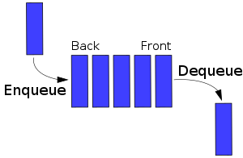
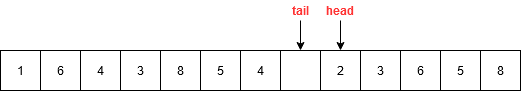

# Queue

**Содержание:**
- [Описание](#описание)
- [Операции на очереди](#операции-на-очереди)
- [Имплементация](#имплементация)
    - [Имплементация с помощью кольцевого буфера (bounded)](#имплементация-с-помощью-кольцевого-буфера-bounded)
    - [Имплементация на основе связного списка (unbounded)](#имплементация-на-основе-связного-списка-unbounded)
- [Java Collections](#java-collections)
- [Применение](#применение)

---

## Описание

**Очередь (queue)** - это абстрактный тип данных, который содержит коллекцию элементов, организованных по принципу *FIFO*.

Принцип **FIFO** (*first in, first out* — «первым пришёл — первым ушёл») предполагает, что элемент, первым попавшим в коллекцию, должен быть первым удален или обслужен. Принцип LIFO, по которому работает стек, полная противоположность этому - там элемент, пришедший первым, обслуживается самым последним, отдавая приоритет другим последним пришедшим элементам.

То есть, разница между очередью и стеком следующая: в очереди мы кладем новый элемент в один конец коллекции, но забираем с другого, а в стеке мы кладем новый элемент в один конец коллекции и забираем с него же.

Очередь более похожа на принципы реальной жизни: тот человек, что обратился к ресурсу первым, обслуживается первым.

## Операции на очереди

Очередь должна поддерживать следующие основные операции:

- ***Enqueue (Add):*** добавить элемент в конец очереди
- ***Dequeue (Remove):*** снять элемент с начала очереди



Во всех популярных имплементациях обе операции выполняются за константное время.

---

## Имплементация

Для имплементации очереди хорошо подходят кольцевой буфер и связный список.

### Имплементация с помощью кольцевого буфера (bounded)

В данной имплементации мы сделаем ограниченную по размеру (bounded) очередь, используя *[кольцевой буфер (circular buffer)](https://en.wikipedia.org/wiki/Circular_buffer)*.

Мы заводим два указателя: *голова (head)* и *хвост (tail)*. Голова указывает на ячейку, элемент в который надо прочитать следующим, а хвост - на ячейку, куда надо положить новый элемент. Оба указателя при инициализации будут указывать на нулевую ячейку массива. Идея заключается в том, чтобы голова и хвост постоянно крутились по кругу в массиве, пока свободно место - если голова или хвост достигают последней ячейки массива, их индекс сбрасывается и они начинают обход массива снова с первой ячейки массива.

Вот как имплементируем операции:
1. **Добавление:** вставляем новый элемент в ячейку `tail` и сдвигаем tail вперед
2. **Чтение:** читаем элемент из ячейки `head` и сдвигаем head вперед

Если бы мы использовали для имплементации обычный массив, а не кольцевой буфер, то каждый раз при снятии элемента с очереди нам пришлось бы смещать все элементы влево для того, чтобы следующий для чтения элемент оказался в начале массива, потому что в такой имплементации мы всегда берем следующий элемент с начала массива.

Вот как мы обработаем заполненность очереди:
1. **Полная очередь:** мы знаем, что места в очереди не осталось, если *хвост при сдвиге вперед догонит голову* - `tail + 1 == head`
2. **Пустая очередь:** мы знаем, что очередь пуста, если *голова равна хвосту* - `head == tail`. То есть, голова теперь указывает на ячейку, куда ещё не был положен элемент

Для того, чтобы такие проверки были возможны, нам придется оставить 1 ячейку массива пустой, потому что хвост не должен догонять голову.

Для наглядности, это ситуация полной очереди:



Здесь показана ситуация, когда произошла вставка элемента 4 и `tail` сместился вперед. Мы видим, что мы имеем пустую ячейку, чтобы положить новый элемент, однако если мы это сделаем, то `tail` будет равен `head` - а это на самом деле ситуация пустой очереди.


Здесь показана ситуация, когда все элементы были прочитаны и удалены (серым цветом показаны взятые из очереди элементы), и `head` догнал `tail`.

Итак, приступим к написанию кода. Заведем нужные переменные и конструктор:

```java
    private final E[] q;

    private final int arraySize = 64;

    /**
     * Голова.
     */
    private int head;

    /**
     * Хвост.
     */
    private int tail;

    @SuppressWarnings(unchecked)
    public ArrayQueue() {
        q = (E[]) new Object[arraySize];
        head = 0;
        tail = 0;
    }
```

Теперь напишем вспомогательную функция для сдвига указателя:

```java
    private int movePointer(int pointer) {
        int next = ++pointer;
        if (next == arraySize) {
            return 0;
        }
        return next;
    }
```

Операция добавления вставляет элемент в ячейку массива, на которую указывает `tail`, а затем сдвигает `tail` вперед. При этом необходимо проверить, что очередь не переполнена, то есть не догонит ли хвост голову при сдвиге вперед.

```java
    public E add(E e) throws IllegalStateException {
        int tail = this.tail;
        if ((tail + 1 == head) || (head == 0 && tail + 1 == arraySize)) {
            throw new IllegalStateException(Queue is full);
        }

        q[tail] = e; /*вставляем новый элемент*/
        this.tail = movePointer(tail); /*сдвигаем хвост*/
        return e;
    }
```

Операция чтения забирает элемент с текущей головы и сдвигает голову вперед. При этом необходимо проверять, не пуста ли очередь, а пуста очередь тогда и только тогда, когда голова догнала хвост (то есть после последнего добавления элемента хвост сместился вперед, но новый элемент еще не был записан).

```java
    public E remove() throws NoSuchElementException {
        int head = this.head;
        if (head == tail) {
            throw new NoSuchElementException(Queue is empty);
        }
        E e = q[head];
        q[head] = null;
        this.head = movePointer(head);
        return e;
    }
```

### Имплементация на основе связного списка (unbounded)

Имплементация очереди на основе связного списка позволяет неограниченно добавлять элементы в очередь, то есть здесь мы делаем unbounded queue.

Для имплементации нам хватит односвязного списка: добавлять элементы мы будем в конец, а брать элементы - с начала (можно наоборот), тем самым получая принцип FIFO. Обе операции работают за время $O(1)$.

Добавление элемента в очередь:

```java
    public E add(E e) {
        linkedList.insertLast(e);
        return e;
    }
```

Взятие элемента из очереди:

```java
    public E remove() {
        return linkedList.removeFirst().value;
    }
```

## Java Collections

Самая популярная имплементация очереди в Java - это [ArrayDeque](https://docs.oracle.com/javase/8/docs/api/java/util/ArrayDeque.html). Также имеется [LinkedList](https://docs.oracle.com/javase/8/docs/api/java/util/LinkedList.html), который однако почти не используется. Обе имплементации предоставляют динамически расширяемую очередь (unbounded).

## Применение

Очереди используются в следующих задачах:
- Когда необходимо обслужить данные или задачу, но на данный момент для этого нет ресурсов. Тогда, применив очередь, эти данные или задачи будут обслужены в порядке очереди. Пример - Kafka, RabbitMQ (брокеры сообщений)
- Поиск в ширину (Breadth-First Search)
- И другие задачи, где может понадобиться принцип FIFO
