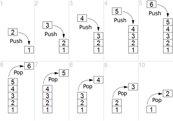

# Stack

**Содержание:**
- [Описание](#описание)
- [Операции на стеке](#операции-на-стеке)
- [Имплементация](#имплементация)
    - [Имплементация с помощью массива](#имплементация-с-помощью-массива)
    - [Имплементация с помощью связного списка](#имплементация-с-помощью-связного-списка)
- [Java Collections](#java-collections)
- [Область применения](#область-применения)

---

## Описание

**Стек (Stack)** - это абстрактный тип данных, представляющий собой коллекцию элементов, организованных по принципу *LIFO*.

Принцип **LIFO** (*last in, first out*, «последним пришёл — первым ушёл») предполагает, что элементы добавляются и удаляются только с одного конца. Данный принцип применяется в тех случаях, когда последние данные, добавленные в коллекцию, должны быть обработаны в первую очередь.

## Операции на стеке

На стеке определены следующие основные операции:

- ***Push***: добавить новый элемент
- ***Pop***: удаляет и возвращает первый элемент

Также дополнительно может быть определена операция ***Peek***, которая возвращает первый элемент, но не удаляет его из стека.

Все эти операции добавляют и забирают элемент с конца стека, именуемого как *вершина стека (top)*.

Пример работы стека:



---

## Имплементация

Стек может быть имплементирован с помощью массива или связного списка.

### Имплементация с помощью массива

С помощью статического массива мы имплементируем ограниченный по размеру стек. Хотя можно имплементировать и не ограниченный по размеру стек с помощью динамического массива (в действительности ограниченный размером heap памяти), но здесь мы специально сделаем ограниченный по размеру, чтобы показать ошибку StackOverflow.

Для имплементации стека нам необходимо будет хранить индекс последнего добавленного элемента - переменную $\textit{top}$,- тем самым мы будем знать, где лежит последний элемент и куда нам необходимо вставить новый элемент. На стадии инициализации $\textit{top}=-1$, обозначая пустой стек.

Итак, это наши переменные и конструктор:

```java
    private final E[] a;

    private int top; // индекс последнего добавленного элемента

    private final int arraySize = 64;

    @SuppressWarnings({unchecked})
    public ArrayStack() {
        a = (E[]) new Object[arraySize];
        top = -1;
    }
```

Теперь имплементируем операцию ***push***. Сначала нам надо увеличить переменную $\textit{top}$, сдвигая индекс последнего элемента, а затем просто положить в ячейку массива новый элемент, при этом не забывая про переполнение стека:

```java
    public E push(E item) {
        if (++top == arraySize) {
            throw new StackOverflowException();
        }
        a[top] = item;
        return item;
    }
```

Операция ***pop*** также довольно тривиальна. Мы сохраняем в области функции последний добавленный элемент, который находится в ячейке $\textrm{arr[\textit{top}]}$, уничтожаем ссылку на элемент в ячейке массива, декрементируем переменную top, и возвращаем ранее сохраненный элемент:

```java
    public E pop() {
        if (top == -1) {
            throw new EmptyStackException();
        }
        E elem = a[top];
        a[top] = null; // занулить ссылку, чтобы помочь GC
        --top;
        return elem;
    }
```

### Имплементация с помощью связного списка

Данная имплементация будет поддерживать неограниченный рост стека (ограниченный heap памятью JVM). Для имплементации нам хватит односвязного списка: добавлять и удалять элементы мы будем с его начала. Ранее мы уже имплементировали односвязный список, так давайте же заиспользуем его.

Заводим переменную для внутреннего списка и определим стадию инициализации в конструкторе:

```java
    private SinglyLinkedList<E> linkedList;

    public LinkedListStack() {
        this.linkedList = new SinglyLinkedList<>();
    }
```

Операция ***push*** - нам всего лишь необходимо положить элемент в начало списка:

```java
    public E push(E item) {
        linkedList.insertFirst(item);
        return item;
    }
```

Операция ***pop*** - удаляем и возвращаем элемент с начала списка:

```java
    public E pop() {
        Node<E> node = linkedList.removeFirst();
        if (node == null) {
            throw new EmptyStackException();
        }
        return node.value;
    }
```

---

## Java Collections

В Java операции стека предоставляет интерфейс *[Deque](https://docs.oracle.com/en/java/javase/17/docs/api/java.base/java/util/Deque.html)*.
Основная используемая имплементация данного интерфейса - это [ArrayDeque](https://docs.oracle.com/en/java/javase/17/docs/api/java.base/java/util/ArrayDeque.html), использующая динамический массив. Также существует имплементация на основе двусвязного списка - [LinkedList](https://docs.oracle.com/en/java/javase/17/docs/api/java.base/java/util/LinkedList.html), - но она не очень эффективна.

---

## Область применения

- Создание стековой машины, вычисляющей выражения, записанные в RPN (Reverse Polish notation) нотации
- Для обхода графов и деревьев - например, Depth-First Search (DFS)
- Call Stack - участок памяти треда, который хранит вызываемые функции. Помните исключение StackOverflow? Оно как раз появляется когда стековая память треда заканчивается
